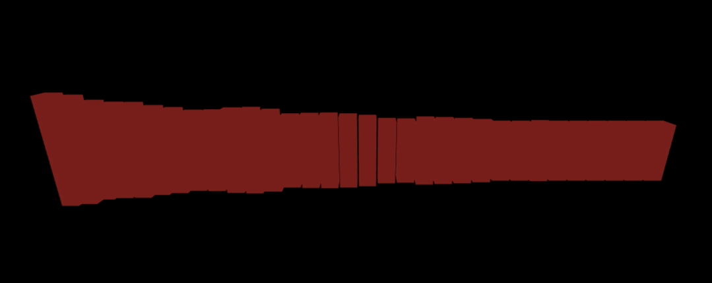
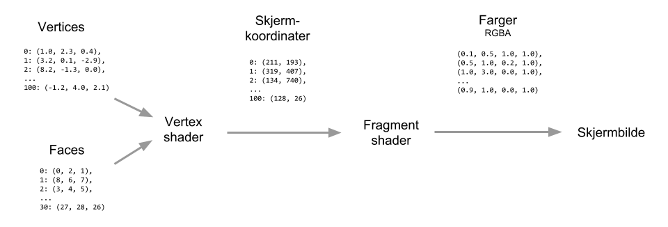

# Dag 1: Intro til WebGL og `three.js`

## Introduksjonsforelesning

[Slides om WebGL og 3D programmering](https://bekk.github.io/avansert-visualisering-kursserie/dag1/slides/om-3d-visualisering.html)

[Slides om three.js](https://bekk.github.io/avansert-visualisering-kursserie/dag1/slides/om-threejs.html)

## Oppgaver

- [Oppgave 1](#oppgave-1)
- [Oppgave 2](#oppgave-2)
- [Oppgave 3](#oppgave-3)

## Oppgave 1

> Hello three.js

Du skal lage en snurrende kube. Den ultimate introen til WebGL og three.js

### Komme i gang

Du har fått utdelt noe kode som du finner i `dag1`-mappen.

```sh
dag1/
├── bilder/                     # Bilder vi har i denne teksten
├── fasit/                      # Fasiten på de ulike oppgavene
├── slides/                     # Slides som har blitt vist frem
├── README.md                   # Denne teksten
├── index.html                  # HTML-fila som kjører koden vår
├── index.js                    # JS-fila som blir kjørt
├── package-lock.json           # Oversikt over versjonsnummere etc
└── package.json                # Avhengigheter etc
```

For å sparke i gang utviklingsprosessen, gjør følgende i en terminal:

```sh
cd sti/til/avansert-visualisering-kursserie/dag1
npm install
npm start
```

Så åpner du `http://localhost:9966` i din utvalgte nettleser.

Du skal da kunne se teksten `Velkommen til kurs!` på skjermen.

### Skrive kode

All kode kan skrives i `index.js`-fila du finner i denne mappa. Prosessen du startet i sted vil sørge for at nettleseren blir oppdatert med nyeste kode når du lagrer den fila.

For å holde oppsettet så enkelt som mulig, har vi droppet å dra inn rammeverk som React eller Vue, så her er det bare å kjøre på med helt vanlig moderne JavaScript.

I `index.js`-fila er det laget en veldig enkel boilerplate:

```js
// Henter inn three.js
const THREE = require("three");

function init() {
  // Her kan du putte kode som bare skal gjøres én gang
}

function render() {
  // sørger for å køe et nytt kall til render
  requestAnimationFrame(render);

  // Her kan du putte kode som skal gjøres hver "frame",
  // som feks renderer.render();
  // eller box.position.x += 10
}

// Kall init-koden
init();
// Spark i gang render-loopen
render();
```

Hvordan du strukturerer koden videre er opp til deg, dette er kun ment som forslag. I oppgaveteksten under vil det stå korte kodesnutter for å illustrere hvordan API-et til three.js funker, hvor du velger å kalle de funksjonene og legge variabel-deklarasjoner er opp til deg selv. Det kan være greit å huske på hvordan scoping fungerer i JavaScript hvis du ønsker å benytte en variabel i flere funksjoner.

### Lage `three.js` renderer, scene og kamera

De første tingene du må lage for å komme i gang med `three.js` er:

- en renderer til å tegne ting på skjermen
- en scene som kan holde på elementene du vil tegne
- et kamera som styrer hva du "ser" i scena.

For å lage en renderer bruker du [`WebGLRenderer`](https://threejs.org/docs/index.html#api/renderers/WebGLRenderer) fra `three.js`. Hvis du ikke sender inn noen parametre til den vil den automatisk opprette et `canvas`-element for deg, som vil fungere som kontekst for WebGL-visualiseringen din.

```js
let renderer;
renderer = new THREE.WebGLRenderer();
```

Du kan også sette høyde og bredde på renderen. En veldig vanlig ting å gjøre her er å sette høyde og bredde til størrelsen på browservinduet.

```js
const WIDTH = window.innerWidth;
const HEIGHT = window.innerHeight;
renderer.setSize(WIDTH, HEIGHT);
```

Renderen oppretter som sagt et `canvas`-element for deg, hvis du ønsker å se noe som helst må du legge til det elementet på nettsiden.

```js
document.body.appendChild(renderer.domElement);
```

Men for at renderen skal kunne rendre noe må den ha en scene og et kamera.

En [`Scene`](https://threejs.org/docs/index.html#api/scenes/Scene) er en gruppering av objekter som visualiseringen din består av. Å initiere en scene kan du gjøre på denne måten:

```js
let scene;
scene = new THREE.Scene();
```

Senere kommer vil også til å legge til objekter i scenen, men dette holder for nå.

Vi trenger også et kamera til å beskue scenen. Det finnes mange ulike kamera som har ulike egenskaper, men for vårt formål passer et [`PerspectiveCamera`](https://threejs.org/docs/index.html#api/cameras/PerspectiveCamera) utmerket. Det er laget for å ligne måten vi mennesker ser ting og det har forholdsvis enkle egenskaper.

```js
let camera;
camera = new THREE.PerspectiveCamera(fov, WIDTH / HEIGHT, near, far);
```

`PerspectiveCamera` tar fire argumenter:

1.  Field of View. Hvor mange grader er synsfeltet til kameraet?
2.  Aspect Ratio. Hva er forholdet mellom høyde og bredde?
3.  Near. Hvor nærme må noe være for å være nærme? Dette påvirker synligheten til objekter.
4.  Far. Hvor langt unna må noe være for å være langt unna? Dette påvirker også synligheten til objekter.

`fov` er gjerne en verdi mellom 0 og 90 grader. For vårt formål er en verdi mellom 45 og 70 godt egna.

`near` og `far` styrer hvilke objekter kameraet ser. For vårt formål er `0.01` og `1000` egna verdier. Da vil objekter som befinner seg mellom `0.01` og `1000` i koordinatsystemet være synlige.

Nå som vi har både en scene og et kamera kan vi be rendereren om å tegne ting

```js
renderer.render(scene, camera);
```

Det er fortsatt ikke stort å se, for vi har ingen objekter i scenen. Men hvis du får en svart skjerm er sannsynligheten stor for at ting er OK.

### Hello Cube!

Vår første oppgave er å få en cube til å vises på skjermen. For å få til det trenger vi å lage en cube. En cube er et objekt, og de fleste objekter i `three.js` består av en geometri og et materiale. Geometrien avgjør formen på objektet og materiale avgjør utseende.

Den enkleste objekttypen er noe som kalles [`Mesh`](https://threejs.org/docs/index.html#api/objects/Mesh) som består av en masse trekanter, som vi vet WebGL er veldig glad i. Det er denne objekttypen vi vil bruke til å lage cuben vår.

Som nevnt trenger vi også en geometri, `three.js` har en hendig metode klar til bruk som heter [`BoxGeometry`](https://threejs.org/docs/#api/geometries/BoxGeometry). Den metoden tar inn tre verdier (høyde, bredde og dybde) og gir oss tilbake en geometri som representerer en boks (eller en cube) med de samme verdiene. Her er det bare å leke seg med verdiene og se på effekten.

```js
let geometry = new THREE.BoxGeometry(1, 1, 1);
```

Vi trenger også et materiale. `three.js` kommer med mange ulike materialer ut av boksen, men et veldig enkelt materiale som lar oss se full 3D-effekt er [`MeshNormalMaterial`](https://threejs.org/docs/#api/materials/MeshNormalMaterial). Det fargelegger geometrien basert på hvilken vei normal-vektoren peker.

```js
let material = new THREE.MeshNormalMaterial();
```

Nå kan vi kombinere de tre tingene og lage en ferdig kube

```js
let cube;
function makeCube(height, width, depth) {
  let geometry = new THREE.BoxGeometry(height, width, depth);
  let material = new THREE.MeshNormalMaterial();
  cube = new THREE.Mesh(geometry, material);
}
```

For at kuben skal vises i visualiseringen vår må vi legge den til scena

```js
scene.add(cube);
```

Men du ser antageligvis ingenting! Det er fordi kameraet vårt for øyeblikket befinner seg på akkurat samme posisjon som kuben. Hvis vi flytter kameraet et stykke bakover, vil ting bli synlig.

```js
camera.position.z = 5;
```

Det var kanskje litt uimponerende, kuben ser helt flat ut. Men det kan vi fikse på ved å rotere kuben litt.

### Rotere kuben

Alle objekter i `three.js` har noen attributter som styrer hvor de befinner seg, hvor store de er og hvilken vei de er rotert. Vi har allerede sett et eksempel på dette når vi endret posisjonen til kameraet for å se kuben.

For å endre på hvilken vei kuben vår er rotert kan vi sette noen verdier på rotasjonen til kuben.

```js
cube.rotation.x = 1;
cube.rotation.y = 0.5;
cube.rotation.z = 1.25;
```

Da vil du kunne se at kuben har distinkte sider og faktisk er et 3D-objekt!

Men vi kan ta dette et steg videre og la kuben spinne av seg selv. For å få til det må vi endre rotasjonen litt hver frame og be rendereren om å tegne ting på nytt.

```js
const SPEED = 0.01;
function rotateCube() {
  cube.rotation.x -= SPEED;
  cube.rotation.y -= SPEED;
  cube.rotation.z -= SPEED;
}
```

Denne funksjonen kan du kalle inne i den funksjonen som blir kalt hver frame (hvis du har beholdt boilerplaten så heter den `render`), sammen med et nytt kall til rendereren's render-metode:

```js
renderer.render(scene, camera);
```

Gratulerer, du har nå en snurrende kube!

Lek deg litt med de ulike verdiene og se hva som skjer med kuben. Noen forslag fra vår side:

- Gi kuben ulik rotasjonshastighet i de ulike retningene
- Endre størrelsen på kubens geometri
- Endre på attributtene til kameraet (near, far, where ever you are 🎶)
- Endre på posisjonen til kameraet.

## Oppgave 2

> Dancing cubes!

Du skal gjøre om din snurrende kube til et ensemble av dansende kuber!

### Før du starter

Hvis du ikke kom helt i mål med forrige oppgave kan du starte ferskt ved å kopiere fasiten som du finner i `fasit/oppgave1/index.js`. Du kan også ta en titt på fasiten ved å kjøre:

```sh
npm run fasit1
```

### OrbitControls

Det første vi skal gjøre er å bruke et kjekt triks fra `three.js` som gjør det litt enklere å jobbe med 3D-kode. [`OrbitControls`](https://threejs.org/docs/index.html#examples/controls/OrbitControls) er en tilleggsmodul til `three.js` som gir oss et kamera som kan kontrolleres med mus. Da kan vi zoome og bevege oss rundt i scena litt som vi vil. Kjekt hvis du feks "mister" et objekt et sted 😅

For å bruke `OrbitControls` må vi først laste inn modulen det ligger i. Det gjør vi på følgende måte:

```js
const OrbitControlsModule = require("three-orbit-controls");
const OrbitControls = OrbitControlsModule(THREE);
```

Legg spesielt merke til at vi sender inn `THREE` som et argument til modulen for å få en konstruktør som er bundet til den samme instansen av `THREE` vi bruker til resten av koden.

Når vi har en `OrbitControls`-konstruktør kan vi koble den til kameraet vårt for å koble på mus-navigasjon.

```js
let controls;
controls = new OrbitControls(camera);
```

Nå kan du bevege deg fritt rundt i scena du har laga.

### Multiplisere kubene

For å lage et ensemble av dansende kuber trenger vi fler kuber enn vi har til nå.

Det er ikke noe hokus-pokus i `three.js` for å gjøre dette, bare god gammeldags JavaScript. Dette er koden som ble brukt i oppgave 1 for å lage en kube:

```js
let cube;
function makeCube(height, width, depth) {
  let geometry = new THREE.BoxGeometry(height, width, depth);
  let material = new THREE.MeshNormalMaterial();
  cube = new THREE.Mesh(geometry, material);
}
```

Det du må gjøre er å repetere dette så mange ganger du har lyst til. Om du foretrekker `for`-løkker eller `forEach`/`map` er opp til deg selv. Men det vil være en fordel å kunne refere til hver enkelt kube i stegene som kommer etterpå, så lagre alle kubene du lager i en liste 👍

Du kan prøve å skrive om koden som du laga for å rotere kuben i oppgave 1 til å rotere alle kubene du nå har laga.

### Posisjonering av kuber

Litt avhengig av hvordan du gjorde det forrige steget vil kubene havne litt rundt omkring eller kanskje rett oppå hverandre hvis alle fikk samme posisjon.

Nå må du finne en formel for hvordan du ønsker å plassere kubene dine. Du kan plassere hver av dem manuelt hvis du ønsker, men da blir det fort komplisert å endre på hvor mange kuber du har.

Vårt forslag til deg er å lage en funksjon som lar deg beregne posisjonen til en kube gitt nummeret i rekken av kuber og utgangsposisjonen.

```js
function positionCube(cubeNumber, startPosition) {
  // hvor X er et tall på avstanden mellom hver kube
  return startPosition + cubeNumber * X;
}

const start = 0;
for(let i = 0; i < cubes.length; i++) {
  let position = positionCube(i, start);
  cube.position.x = position;
}
```

Her kan du velge å holde det enkelt og kun posisjonere kuber langs en av aksene (feks X-aksen), men det er fritt frem å være litt kreativ her. Det viktigste er at du får sett alle kubene.

Her kan det også være en god ide å endre utgangsposisjonen til kameraet, feks ved å zoome enda litt lengre ut:

```js
camera.position.z = 40;
```

Da vil du se en større del av scena du har laga og forhåpentligvis alle kubene dine.

### Koble på lyd

Det er nå det morsomme starter, koble på input for å endre på ting 🎶 Vi har laga en ferdig liten modul til deg som du kan bruke for å hente input fra mikrofonen på laptopen din:

```js
const analyse = require("./fasit/oppgave2/soundanalyser.js");
```

Den modulen kan du bruke på denne måten:

```js
init(); // Kaller init-funksjonen din som vanlig for å sette opp ting

let analyser; // Ta vare på en referanse til analyseren din

// Kall analyse-funksjonen, den tar inn options og et callback
analyse(function(a) {
  // Når analyse-funksjonen har kobla seg til mikrofonen
  // vil denne koden bli kjørt

  // Da får du en referanse til analysern, som du bør ta vare på
  analyser = a;

  // Så kan du kalle render-funksjonen din
  // som kicker i gang render-loopen som før
  render();
});
```

> Hvis du lurer på hvordan den modulen ser ut kan du scrolle litt lengre ned, der finner du en kommentert utgave av kildekoden.

Analyser-objektet du får tilbake fra `analyse`-funksjonen har en kjekk metode som heter `analyser.frequencies()`. Den gir deg en liste av decibel-verdier for de ulike frekvensene mikrofonen plukker opp. Frekvensene blir regnet ut med en Fast Fourier Transform (FFT), som i dette tilfellet vil gi deg tilbake en liste med `32` decibel-verdier som representerer alle frekvensene.

I tillegg kan du også lese ut max og min verdien til decibelene mikrofonen plukker opp. De finner du slik:

```js
const maxDecibels = analyser.analyser.maxDecibels;
const minDecibels = analyser.analyser.minDecibels;
```

> Her er det en del rariteter mellom datamaskiner. Hvis du får veldig rar oppførsel med verdiene over kan det lønne seg å bytte dem ut med 0 og 255.

De verdiene er kjekke å ha for å kunne normalisere decibel-verdien til en frekvens. Normalisering er navnet på å regne om en gitt nummer range til en `[0,1]` range.

```js
function normalise(min, max, value) {
  return (value - min) / max;
}
```

Denne funksjonen gir deg tilbake et tall mellom `0` og `1` som svarer til hvor nærme min (nærmere 0) eller max (nærmere 1) value er. Dette er nyttig for å begrense verdiene du jobber med til noe som er innenfor en bestemt range.

Nå som du har noen tall som svarer til hvor mange decibel av en gitt frekvens mikrofonen din har plukket opp kan vi koble disse til kubene vi har laga.

Vi bytter ut koden som snurrer på kubene med noe som heller skalerer kubene etter hvor mye lyd som blir plukka opp.

```js
let frequencies = analyser.frequencies();
function scaleCube(cube, cubeNumber) {
  let frequency = frequencies[cubeNumber];
  let scaleFactor = normalise(minDecibels, maxDecibels, frequency);

  cube.scale.y = scaleFactor;
}
```

Dette vil skalere kuben din i y-retning med en `scaleFactor` som er mellom `0` og `1`. Her er det bare å leke seg 🤹‍♂️

Hvis du har gjort ting riktig vil du nå se at kubene dine danser i takt med det mikrofonen din plukker opp. Gratulerer, du har nå en fiks ferdig musikk visualisering 👍

> Hvis du ikke får mikrofonen til å plukke opp noe, sjekk at du er på `localhost:9966` og ikke IPen til datamaskinen din. `localhost` er fritatt for en del av sikkerhetsmekanismene til nettleseren.

Noen forslag til ting du kan endre på og leke med:

- Skalere kuben i ulike retninger med ulike verdier
- Endre start-størrelsen til kubene dine, kanskje du heller vil ha stolper?
- Endre på posisjoneringen til kubene dine

### Bonus: Forklaring av soundanalyser-modulen

```js
// Bruker en modul som lager en web-audio AnalyserNode for oss
const createAnalyser = require("web-audio-analyser");

// Eksporter en funksjon fra modulen
// Optional options for å enable flere enn 32 frekvenser
module.exports = function analyse(callback, options = { fftSize: 64 }) {
  // Vi ber nettleseren om lov til å bruke en mediaDevice
  // Dette er en del av WebRTC APIet
  navigator.mediaDevices
    // Vi ønsker bare audio, ikke lyd
    .getUserMedia({ video: false, audio: true })
    // Hvis vi får tilgang, får vi et stream-objekt av mikrofonens input
    .then(function(stream) {
      // Så bruker vi mikrofon-streamen til å lage en analyser
      let analyser = createAnalyser(stream, { stereo: false, audible: false });

      // Vi setter fftSizen til analysern i henhold til det vi sendte inn
      analyser.analyser.fftSize = options.fftSize;

      // Så kaller vi callback-funksjonen som ble sendt inn
      callback(analyser);
    })

    // Hvis vi ikke får tilgang til mikrofonen logger vi en feilmelding
    .catch(function(error) {
      console.error(error);
    });
};
```

## Oppgave 3

> Shader-introduksjon

I denne oppgaven skal vi bruke shadere til å fargelegge kubene fra forrige oppgave i henhold til lydstyrken:



## Teori

Vertex- og fragment shadere jobber sammen for å beregne pikslene på skjermen. Når man bruker three.js setter den inn automatisk sine egne innebygde shadere som tar hensyn til attributtene på hver Mesh. Men for fullstendig kreativ frihet skriver man sine egne shadere.

Shadere er skrevet i et C-lignende språk blir kompilert av webgl og sendt til GPU-en. Når shaderkoden kjører på GPU-en har den sitt eget minne på skjermkortet og kjører helt separat fra CPU-en og resten av datamaskinen. Alle vertices og faces lastes over til GPU-minnet av webgl, og er dermed inputen til shaderkoden. Outputen er hvilken farge hver enkelt piksel skal ha på skjermbildet. Denne prosessen kalles rendering.

### Render pipeline

For å oppnå høy ytelse er renderingen arrangert i en pipeline med definert inn- og ut-verdier:



### Data fra JavaScript til GPU

I tillegg til vertices og faces er det mulig å sende over mer vilkårlige data som kan brukes av shaderne. Det kan være tall, vektorer og array av vektorer, og inneholder typisk fargeverdier, teksturer, animasjonsparametere og andre verdier man har tenkt å bruke i shaderne.

JavaScript-koden kjører på CPU-en og har tilgang til datamaskinens vanlige minne. For å holde ytelsen høy er det nøye definert i webgl når og hvordan man kan sende innholdet i variablene sine til shaderen på GPU-en. I denne oppgaven skal vi bruke en `uniform` variabel for å sende lydnivået for hver rendret frame. Slik får vi en variabel som vi kan bruke i shaderne til å gjøre fete ting™:

```javascript
const UNIFORMS = {
  soundLevel: { value: 0.0 }
};
```

Det er viktig her at hver uniform har et felt `value` med selve verdien. Det er fordi den kan også ha andre metadata som f.eks. `type`, som kan være f.eks. vektor eller tekstur. Men i vårt tilfelle skal vi bare ha et tall, og three.js kommer til å skjønne selv at den skal ha typen `float`.

### Shader material

I forrige oppgave brukte vi et av three.js sine innebygde materialer `THREE.MeshNormalMaterial`. For å skrive våre egne shadere må vi bytte til `THREE.ShaderMaterial`, som er et slags rått materiale uten noen definert oppførsel:

```javascript
const material = new THREE.ShaderMaterial({
  uniforms: UNIFORMS, // Objekt med uniform-variabler
  fragmentShader: fragmentShaderCode // String med fragmentshader-koden
});
```

Her legger man merke til at vi ikke definerer noen vertexshader. Da vil three.js bruke en helt standard vertexshader som kun projiserer polygonene fra 3D-rommet til skjermens 2D-koordinater. Vi lærer mer om vertexshadere i dag 2.

Selve shaderkoden er det mest praktisk å lagre i en separat fil som leses inn:

```javascript
const { readFileSync } = require("fs");

const fragmentShaderCode = readFileSync(
  __dirname + "/fragmentshader.glsl",
  "utf8"
);
```

(Dette funker fordi vi har lagt til en liten bit med kode som bundler filer lest på denne måten i byggesteget.)

### WebGL shader language

WebGL shader language er det språket shaderne skrives i, og det ligner veldig mye på C, som igjen ligner veldig mye på gammeldags JavaScript. En viktig forskjell er at det er veldig strengt på at alt er helt riktig, spesielt når det gjelder variablenes typer (float, int). En annen viktig forskjell er at det er mange innebygde operasjoner for vektor- og matrise-regning.

```c
// Eksempler på deklarasjoner

float a = 42.0; // Flyttall (desimaltall)
float b = 42;  // FEIL pga manglende desimaltall til float
int c = 42; // Heltall
bool d = true; // Boolean

vec3 minVektor = vec3(2.0, 1.5, 0.5); // Dette er en 3D vektor. vec2 og vec4 går også an
float enKoordinat = minVektor.x; // Lesing av en koordinat i vektoren

float minProsedyre(float t) { // Prosedyre som kan kalles senere
  t = t - 1;
  return t*t*t + 1.0;
}

float minVerdi = minProsedyre(2.3); // Kall på prosedyren
```

```c
// Eksempler på operasjoner

float e = (a + c) / 23.0;

vec3 lengerVektor = minVektor * 3.0; // Vektor ganger skalar! (x * 3.0, y * 3.0, z * 3.0)
vec3 prikk = minVektor * annenVektor; // Prikkprodukt! OMFG

float f = sin(0.5); // sinus
float g = pow(2.0, 8.0); // 2^8
```

De fleste matematiske og geometriske operasjoner man trenger er definert. Et praktisk oppslagsverk finnes her: http://www.shaderific.com/glsl-functions/

### fragmentshader.glsl

Tilbake til koden vår. Innholdet i `fragmentshader.glsl` definerer altså fargen til hver piksel. Shaderen vår trenger en inngang, og det er standard i glsl at det er en prosedyre med navn `main`:

```c
void main() {
  // Denne koden kjøres først
}
```

Nå har forfatteren fortalt i det lange og brede om denne pikselfargen som er outputen til fragmentshaderen. Og her er den. Det er så enkelt som at man skriver til en foråndsdefinert variabel som heter `gl_FragColor`:

```
  gl_FragColor = vec4(0.5, 1.0, 0.5, 1.0); // Red, blue, green, alpha
```

Prøv dette. Fargen skal bli lys grønn, og det er fordi fargen er en 4D-vektor med RGBA (rød, grønn, blå, alpha-gjennomsiktighet). `gl_FragColor` er en såkalt output-variabel og er til stedet automatisk og brukes som en vanlig variabel. Farge-elementene er tall mellom 0.0 og 1.0, hvor (1.0, 1.0, 1.0) dermed er helt hvitt.

Men, vi skal ha rød farge. Lag en variabel `baseRed` som inneholder en `vec4` med en rødfarge du bestemmer selv.

For å parametisere akkurat hvor sterk rødfargen blir kan vi bruke glsl sine vektor-operasjoner til å gange `baseRed` med et tall:

```c
gl_FragColor = baseRed * 0.5; // (baseRed.x*0.5, baseRed.y*0.5, baseRed.z*0.5, baseRed.w*0.5)
```

Prøv å endre tallet fra `0.5` til `1.0` og `0.1`. Rødfargens styrke styres nå enkelt av dette tallet.

Hva med alpha-verdien, spør du nå. Du er jo en oppmerksom student. Joda, i prinsippet skaleres også den ned, men akkurat i vår kode ignoreres gjennomsiktighet fordi vi ikke har skrudd det på. Om du vil leke med gjennomsiktighet kan du spesifisere det i materialet:

```c
new THREE.ShaderMaterial({
  ...
  transparent: true, // Er default false pga ytelse
});
```

### Lydstyrke

Nå må vi koble sammen lyd og bilde. Dette må gjøres i JavaScript-koden, siden det er der lyddataene finnes. Det er mange måter å beregne lydstyrke på, men en som er ganske enkel er å summere styrken på alle frekvensene fra lydanalysen:

```javascript
let soundLevel = 0;
for (let i = 0; i < frequencies.length; i++) {
  soundLevel = soundLevel += frequencies[i];
}
```

For å sende denne til shaderen trenger vi bare skrive over `value`-feltet til uniformen:

```javascript
UNIFORMS.soundLevel.value = soundLevel;
```

Three.js vil oppdage at uniformen har endret verdi og sende over den nye verdien til gpu-minnet.

Tilbake til shaderkoden vår tar vi uniformen i bruk. Siden glsl er så strengt må den deklareres først med type `float`:

```c
uniform float soundLevel; // Denne blir globalt tilgjengelig for hele shaderen
```

Fett, la oss sende den rett inn i outputen:

```c
gl_FragColor = baseRed * soundLevel;
```

Resultatet blir en skuffende lav korrelasjon til lyden. Vi har truffet en typisk fallgruve i shaderprogrammering, og det er at koden vår legger opp til at `soundLevel` bør være et sted mellom 0.0 og 1.0.

Prøv å skrive ut soundLevel i konsollen og se:

```
console.log(soundLevel);
```

Skaler etterpå tallet i koden med å dele det for å få den ned på rimelige verdier. Resultatet skal være en visualisering rimelig lik bildet i starten av oppgaven.
