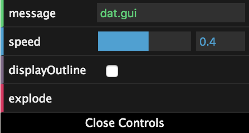
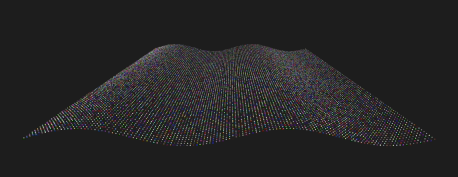

# Del 2: Dypdykk i shaderprogrammering

## Oppgaver

- [Oppgave 4](#oppgave-4)
- [Oppgave 5](#oppgave-5)
- [Oppgave 6](#oppgave-6)

## Oppgave 4

> Interaktiv stjerne

I denne oppgaven skal vi bruke en fragmentshader til å lage en fin stjerne med interaktive kontrollere:


### Utdelt oppsett

I mappen `oppgave-4-fragment-shader` finner du et oppsett som ligner det vi lagde på dag 1, men uten noe innhold. Her skal du skrive koden for denne oppgaven.

Du kjører koden i denne mappa med kommandoen

```
npm run oppgave4
```

Den utdelte koden har en gjennomsiktig gul `PlaneGeometry` oppå en fin stjernebakgrunn. I løpet av oppgaven skal vi forme denne gule firkanten til en stjerne.

### Teori

Siden det er flere dager siden forrige gang kan det være greit å friske opp teorien fra siste oppgave den forrige kursdagen før man går videre: (LINK TIL OPPGAVE-3-SHADER-INTRO)
  
### Anatomy of a star

For å tegne stjernen vil vi bruke polarkoordinater. Da kan vi ha forskjellige intensitet i sentrum, og vi kan ha stråler som varierer med vinkelen rundt sentrum.

(bilde av polarkoordinater-systemet)

`position` er et punkt i det vanlige 3D-koordinatsystemet, såkalt kartesisk system. Og den matematiske formelen for å konvertere kartesiske koordinater til polarkoordinater er:

```c
polarkoordinater(x, y) = (
    sqrt(x*x + y*y), // sqrt er kvadratrot
    atan(y / x) // atan er arctangens
);
```

I den utdelte koden ligger x og y i `vertexPosition.x` og `vertexPosition.y`. Det er en vec2 som går fra (-1, -1) til (1, 1). 

Siden `sqrt(x*x + y*y)` er lik lengden av vektoren kan vi bruke funksjonen `length()`:

```c
float radius = length(vertexPosition);
float angle = atan(vertexPosition.y / vertexPosition.x);
```

Og da kan vi endelig lage en stjerne som en enkel disk ved å sette gjennomsiktigheten til maks utenfor en viss radius:

```c
float coreSize = 0.1;
float alpha = radius < coreSize ? 1.0 : 0.0;
```

Nå har du en enkel ball.

### Sexify

For å få det riktig fint skal vi legge til glød på stjernen vår. En bra glød starter intenst og så faller av brått

(TODO: x-y-graf over glød som avtar exponensielt med radius fra og med coreSize)

Vi starter med å regne ut et praktisk tall som sier hvor langt unna ytterkanten av stjernens kjerne vi er:

```c
float glowDistance = clamp(radius - coreSize, 0.0, 1.0);
```

`clamp(x, a, b)` er en funksjon som returnerer x, med mindre den er mindre enn a, da får man a. Eller med mindre den er større enn b, da får man b. Så med andre ord er man garantert å få noe mellom a og b. Praktisk for å unngå feil tall, slik som når radius er mindre enn coreSize.

Nå kan vi øke beregne glow som inverse av denne avstanden, og legge den til alpha slik at fargen kommer frem i gløden:

```c
float glow = 1.0 - glowDistance;
alpha += glow;
```

Dette er jo lineær avtagende glød, som ikke er så pent. Vi ønsker at den avtar litt mer eksponensielt, og en lett måte å oppnå det er å opphøye tallet i f.eks. 3:

```c
float glowFalloff = 3.0;
glow = pow(glow, glowFalloff);
```

La oss parameterisere intensiteten videre ved å gange det hele med et tall:

```c
float glowIntensity = 0.9;
glow *= glowIntensity;
```

Stjernen vår er fin, men føles det som den blender deg? Nei, det er litt flat gulfarge, men ingen blendende supernova. Et supertriks her er å øke alle farge-elementene for å få hvitere farge nærmere sentrum:

```c
float brightness = 0.9;
color += glow * brightness;
```

### Let there be beams

Siste prikken over i-en blir stråler som skinner ut av stjernen. Her kan vi bruke `angle` fra polarkoordinatene. Hvis intensiteten er en sinusbølge får vi pene stråler:

(x-y-graf over sinus over vinkel)
(polar-graf over sinus over vinkel)

Vi regner ut et wave-tall som er sinusbølgen av polarkoordinat-vinkelen:

```c
float nofBeams = 6.0;
float wave = sin(angle * nofBeams);
```

Her ser vi også en lett måte å kontrollere frekvensen til sinusbølger, nemlig å gange vinkelen med en konstant `nofBeams`.

Men, siden sinus er en verdi fra -1 til +1, får vi negative stråler også, og det vil vi ikke. Så vi clamper bølgen til 0.0 - 1.0: 

```c
wave = clamp(wave, 0.0, 1.0);
```

Så øker vi bare alpha slik at strålene synes i samme farge som stjernen:

```c
alpha += wave;
```

Dette blir ganske voldsomme stråler, som du kan se. Så vi gjenbruker teknikken til å redusere glød utover med avstanden til kjernen:

```c
float beamFalloff = 1.0 - glowDistance;
float beamStrength = 0.075;
wave *= beamStrength * beamFalloff;
```

Nå har vi en komplett stjerne. De viktige parameterne ble 

- `color`
- `coreSize`
- `glowIntensity`
- `glowFalloff`
- `brightness`
- `nofBeams`
- `beamStrength`

### Live-parametrisering med dat.GUI-kontrollpanel

Når man har så mange interessante parametre er det såklart ekstra fett å kunne manipulere dem live. Helt til slutt i denne oppgaven skal vi bruke biblioteket dat.GUI og `uniforms` til å lage et slikt kontrollpanel.

#### dat.GUI

dat.GUI er et lite bibliotek for å lage små kontrollpanel til prototyping:



For å bruke det importerer vi det og initialiserer en instans:

```javascript
const dat = require('dat.gui');

const gui = new dat.GUI();
```

Så legger vi til en parameter for coreSize. dat.GUI fungerer ved at den endrer verdien direkte på parameterobjektet, og man kan spesifisere min- og max-verdi for å få en slider mellom disse ytterpunktene:

```c
const parameters = {coreSize: 0.1};

gui.add(parameters, "coreSize", 0.02, 0.5);
```

Mer dokumentasjon for dat.GUI finnes her: http://workshop.chromeexperiments.com/examples/gui/#1--Basic-Usage 

Nå får du opp en slik slider for coreSize. Men det skjer ikke noe man drar den. Det er fordi coreSize-verdien kun ligger i parameters-objektet. Vi må få den inn i shaderen.

#### Parametrisering av shaderen

I shaderen blir dette ganske enkelt. Vi må bytte ut hardkodet `coreSize` med en uniform:

```c
uniform float coreSize;
```

og legge til uniformen i `uniforms` som blir sendt til ShaderMaterial:

```javascript
const uniforms = {
    coreSize: {value: 0.1}
};
```

Vi lager en funksjon for å oppdatere uniformene:

```javascript
function updateUniforms() {
    uniforms.coreSize.value = parameters.coreSize;
}
```

Og kaller den for hver render: 

```javascript
function render() {
  requestAnimationFrame(render);

  updateParameters();

  renderer.render(scene, camera);
}
```

Da kan vi styre størrelsen på stjernen live via kontrollpanelet.

Gjør det samme for å parametrisere alle de andre parameterne.

Tips: For å legge til color picker i dat.GUI bruker man `gui.addColor()` i stedet for `.add()`. Parameterverdien blir da en hex-string slik som `"#ff9500"`. Denne kan vi sende til en vec3-uniform via THREE.Color:

```javascript
uniforms.baseColor.value = new THREE.Color(params.baseColor);
```

## Oppgave 5

> Wobbling sphere

Du bruker en vertex shader til å lage en boblende, kokende ball of love

## Oppgave 6

> Partikkelsystem

I denne oppgaven skal du benytte deg av GPU-ens enorme parallellitet for å visualisere tusenvis av partikler:



### Utdelt oppsett

I mappen `oppgave-6-particle-system` finner du et oppsett med den vanlige boilerplate-koden. Her skal du skrive koden for denne oppgaven. Du skal ikke bygge på den forrige oppgaven.

### Partikler i webgl

Partikkelsystemer fungerer ganske likt som vanlige geometrier og mesher. Men, det er kun vertices som brukes, og faces ignoreres. Hver vertex blir en partikkel med posisjon gitt av vertexshaderen, men i stedet for at fragmentshaderen fargelegger faces brukes den til å fargelegge en "flat" todimensjonal firkant der hver vertex position befinner seg på skjermen. 

Three.js har en egen klasse `THREE.Points` for partikler som fungerer på akkurat denne måten. Vi legger den til `scene` som alle andre objekter:

```javascript
const points = new THREE.Points(geometry, material);
scene.add(points);
```

Materialet er faktisk helt likt som før. Og det er jo logisk siden vårt `ShaderMaterial` er helt rått uten definert oppførsel:

```javascript
const material = new THREE.ShaderMaterial({
    uniforms: uniforms,
    vertexShader: vertexShaderCode,
    fragmentShader: fragmentShaderCode,
    transparent: true
});
```

Geometrien er derimot litt spesiell. Vi lager en `BufferGeometry`, som er en helt rå geometri uten noe innhold. Rått er som vanlig bra. Vil vil rett på jernet her:

```javascript
const geometry = new THREE.BufferGeometry();
```

Den er så himla rå at vi til og med må allokere plass på GPU-minnet til posisjonene til alle verticene. I dette minnet er stort sett alt floats, og siden posisjonene er vektorer av tre floats må vi allokere 3 floats for hver partikkel. Vi setter antall partikler til 125 * 125 som blir rundt femten tusen tilsammen:  

```javascript
const nofParticles = Math.pow(125, 2);
const positions = new Float32Array(nofParticles * 3);
```

Vi bruker `Float32Array` i stedet for et vanlig javascript-array for å få 32-bit floats som GPU-en forventer. Et vanlig array ville bestått av javascript sin `Number` som er en brukervennlig klasse, men for lite spesifikk på hvor mange bits den okkuperer i minnet. 

Til slutt spesifiserer vi selve allokeringen ved å legge til et `attribute` på geometrien. Tallet `3` her forteller webgl at floatene skal grupperes tre og tre, slik at de kan brukes som `vec3` i shaderen.

```javascript
geometry.addAttribute('position', new THREE.BufferAttribute(positions, 3));
```

Kommer det noe opp på skjermen? Nei. Årsaken til det er at det mangler en ny output fra vertexshaderen som vi ikke har brukt før: `gl_PointSize`. Den er i tillegg til den kjente `gl_Position`, og den sier hvor stor firkanten til hver vertex skal være på skjermen.

```c
float particleSize = 3.0;
gl_PointSize = particleSize * pixelRatio;
```

Nå har vi noe på skjermen. En enslig partikkel? Nei, det er jo alle femten tusen partiklene på samme posisjon oppå hverandre. På tide å flytte rundt på dem. Men først litt teori.

### Uniforms, attributes og varyings

Vi har lært om `uniform`, men i webgl er det faktisk definert tre typer variabler som shaderkoden bruker. Forskjellen mellom dem er
 
- når de kan endres
- hvilken kode som kan lese dem
- når de leses, om man får verdien deres direkte eller en interpolasjon mellom to nabo-verdier

De tre typene er

- `uniform` Variabler som kan skrives av Javascript-koden og sendes over 1 gang per rendret bilde, er read-only for shaderne og har samme globale verdi for alle vertices og alle piksler til hvert Mesh
  - For eksempel tid, museposisjon, animasjonshastighet, osv
  - Hensikten med dette er at GPU-en så kan kjøre shaderkoden uten å gjøre flere trege dataoverføringen fra resten av datamaskinen
- `attribute` Samme som uniform, men kan kun leses i vertex shader, og skal ha en separat verdi for hver eneste vertex
  - For eksempel farge, teksturkoordinat, osv
  - Hensikten med denne typen er at GPU-en kan optimalisere minnet og kjernene sine slik at flest mulig beregninger kan kjøre samtidig uten å måtte snakke sammen
- `varying` Kan ikke skrives til av Javascript-koden, men av vertexshaderen. Får dermed en separat verdi per vertex. Men den kan leses av fragmentshaderen, og den verdien som leses da er interpolert mellom de tre vertexene som pikselen er mellom
  - Typisk eksempel er den interpolerte fargen pikselen skal ha fra en tekstur. Men generelt er denne typen brukt hvis man vil at vertexshaderen skal beregne en verdi som fragmentshaderen igjen skal bruke til å beregne fargen. Slik kan vertex shader og fragment shader snakke sammen.

### Rutenett

Vi har lyst til å fordelen partiklene i  et rutenett. For å holde ting ryddig lager vi en egen prosedyre for det:

```c
vec3 gridPosition() {
  // Her skal vi regne ut posisjonen
}

void main() {
  vec3 newPosition = gridPosition();
  
  ...
}
```

Hvis hver partikkel har indeks `vertexIndex`, og bredden på rutenettet skal være `w` er formelen for posisjonene ganske enkel:

```
float x = mod(vertexIndex, w);
float y = floor(vertexIndex / w);
```

Hvor `mod` er matamtisk modulo (rest) og `floor` gjør at et tall rundes ned til nærmeste heltall.

Bredden `w` er jo kvadratoren av det totale antall partikler hvis rutenettet skal være kvadratisk. Og i den utdelte koden er dette allerede sendt over til shaderen i en uniform `nofParticles`:

```
float w = floor(sqrt(nofParticles));
```

Men hva med `vertexIndex`? Den har vi ikke. Siden dette er en rå shader må vi sende den over selv som et `attribute` på hve vertex.

```javascript
let vertexIndecies = new Float32Array(nofParticles);

vertexIndecies = vertexIndecies.map((element, i) => i);

geometry.addAttribute('vertexIndex', new THREE.BufferAttribute(vertexIndecies, 1));
```

Den snedige `map`-onelineren fyller hvert element i lista med 0, 1, 2, 3, osv.

Vi må deklarere attributtet i shaderen for å bruke den, akkurat som uniforms:

```c
attribute float vertexIndex;
```

Nå kan vi returnere posisjonen til hver vertex. Siden posisjonen er 3d setter vi høyden til 0 og bruker `y` til dybden:

```c
return vec3(x, 0.0, y); 
```

Der, et rutenett! Men det er to problemer:

- Det er ikke sentrert rundt origo (0, 0, 0)
- Alle prikker har samme størrelse, så prikker lenger unna er like store som de nærme

Vi løser det første problemet lett ved å trekke fra halvparten av bredden fra alle posisjonene:

```c
return vec3(x - w/2.0, 0.0, y - w/2.0);
```

Resultatet kan man se med en gang.

For å skape bedre dybdefølelse endrer vi `gl_PointSize` slik at blir mindre jo lenger unna kamera partiklene er. `gl_Position` inneholder x- og y-koordinatene på skjermen. Og z-koordinaten dens er dybden slik den er sett fra kameraet. Vi deler dermed partikkelstørrelsen på denne z-dybden. Siden dette dybdetallet er ganske høyt må vi øke partikkelstørrelse-tallet vårt ganske mye for å få noenlunde samme partikkelstørrelse nå som den er avhengig av dybden:

```c
float particleSize = 300.0;
gl_PointSize = particleSize * pixelRatio / gl_Position.z;
```

Resultatet er et pent rutenett av firkanter.

### Fra firkanter til prikker

TODO

### Vi fargelegger

TODO

```javascript
let color = new Float32Array(nofParticles * 3);
color = color.map(Math.random);
geometry.addAttribute('color', new THREE.BufferAttribute(color, 3));
```

### Vi legger på bevegelse

TODO (sinusbølge)

### Vi plukker opp de grønne

TODO


