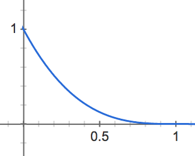
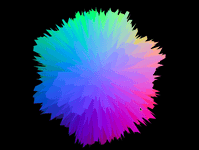
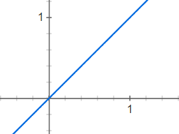
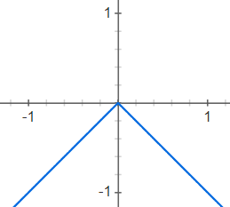
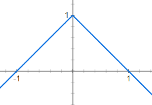
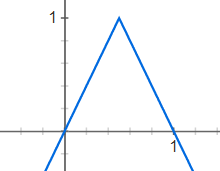
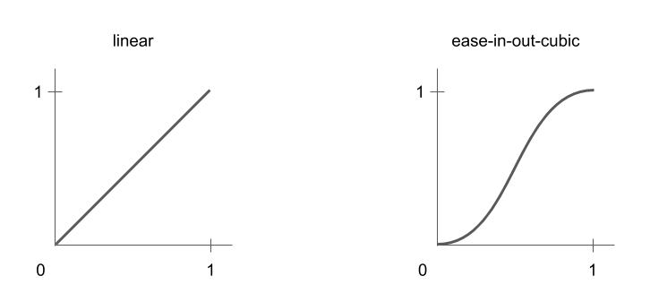

# Dag 2: Dypdykk i shaderprogrammering

## Oppgaver

- [Oppgave 4](#oppgave-4)
- [Oppgave 5](#oppgave-5)
- [Oppgave 6](#oppgave-6)

## Oppgave 4

> Interaktiv stjerne

I denne oppgaven skal vi bruke en fragmentshader til å lage en fin stjerne med interaktive kontrollere:


### Utdelt oppsett

I mappen `oppgave-4-fragment-shader` finner du et oppsett som ligner det vi lagde på dag 1, men uten noe innhold. Her skal du skrive koden for denne oppgaven. Det finnes en `fragmentshader.glsl`, hvor mesteparten av koden skal skrives, og den velkjente `index.js` som binder det hele sammen, pluss en enkel `vertexshader.glsl` som kun er med fordi den trengs for å få fragmentshaderen til å snurre. Det blir mer om vertexshadere i neste oppgave.

Du kjører koden i denne mappa med kommandoen

```sh
npm run start4
```

Den utdelte koden har en gjennomsiktig gul `PlaneGeometry` oppå en fin stjernebakgrunn. I løpet av oppgaven skal vi forme denne gule firkanten til en stjerne.

### Teori

Siden det er flere dager siden forrige gang kan det være greit å friske opp [teorien fra siste oppgave den forrige kursdagen](https://github.com/bekk/3d-visualisering-kursserie/tree/master/dag1#teori) før man går videre.

### Anatomy of a star

For å tegne stjernen vil vi bruke polarkoordinater. Da kan vi ha forskjellige intensitet i sentrum, og vi kan ha stråler som varierer med vinkelen rundt sentrum.

(bilde av polarkoordinater-systemet)

`position` er et punkt i det vanlige 3D-koordinatsystemet, såkalt kartesisk system. Og den matematiske formelen for å konvertere kartesiske koordinater til polarkoordinater er:

```c
polarkoordinater(x, y) = (
    sqrt(x*x + y*y), // sqrt er kvadratrot
    atan(y / x) // atan er arctangens
);
```

I den utdelte koden ligger x og y i `vertexPosition.x` og `vertexPosition.y`. Det er en vec2 som går fra (-1, -1) til (1, 1).

Siden `sqrt(x*x + y*y)` er lik lengden av vektoren kan vi bruke funksjonen `length()`:

```c
float radius = length(vertexPosition);
float angle = atan(vertexPosition.y / vertexPosition.x);
```

Og da kan vi endelig lage en stjerne som en enkel disk ved å sette gjennomsiktigheten til maks utenfor en viss radius:

```c
float coreSize = 0.1;
float alpha = radius < coreSize ? 1.0 : 0.0;
```

Nå har du en enkel ball.

### Sexify

For å få det riktig fint skal vi legge til glød på stjernen vår. En bra glød starter intenst og så faller av brått:



Vi starter med å regne ut et praktisk tall som sier hvor langt unna ytterkanten av stjernens kjerne vi er:

```c
float glowDistance = clamp(radius - coreSize, 0.0, 1.0);
```

`clamp(x, a, b)` er en funksjon som returnerer x, med mindre den er mindre enn a, da får man a. Eller med mindre den er større enn b, da får man b. Så med andre ord er man garantert å få noe mellom a og b. Praktisk for å unngå feil tall, slik som når radius er mindre enn coreSize.

Nå kan vi øke beregne glow som inverse av denne avstanden, og legge den til alpha slik at fargen kommer frem i gløden:

```c
float glow = 1.0 - glowDistance;
alpha += glow;
```

Dette er jo lineær avtagende glød, som ikke er så pent. Vi ønsker at den avtar litt mer eksponentielt, og en lett måte å oppnå det er å opphøye tallet i f.eks. 3:

```c
float glowFalloff = 3.0;
glow = pow(glow, glowFalloff);
```

La oss parameterisere intensiteten videre ved å gange det hele med et tall:

```c
float glowIntensity = 0.9;
glow *= glowIntensity;
```

Stjernen vår er fin, men føles det som den blender deg? Nei, det er litt flat gulfarge, men ingen blendende supernova. Et supertriks her er å øke alle farge-elementene for å få hvitere farge nærmere sentrum:

```c
float brightness = 0.9;
color += glow * brightness;
```

### Let there be beams

Siste prikken over i-en blir stråler som skinner ut av stjernen. Her kan vi bruke `angle` fra polarkoordinatene. Hvis intensiteten er en sinusbølge får vi pene stråler:

(x-y-graf over sinus over vinkel)
(polar-graf over sinus over vinkel)

Vi regner ut et wave-tall som er sinusbølgen av polarkoordinat-vinkelen:

```c
float nofBeams = 6.0;
float wave = sin(angle * nofBeams);
```

Her ser vi også en lett måte å kontrollere frekvensen til sinusbølger, nemlig å gange vinkelen med en konstant `nofBeams`.

Men, siden sinus er en verdi fra -1 til +1, får vi negative stråler også, og det vil vi ikke. Så vi clamper bølgen til 0.0 - 1.0:

```c
wave = clamp(wave, 0.0, 1.0);
```

Så øker vi bare alpha slik at strålene synes i samme farge som stjernen:

```c
alpha += wave;
```

Dette blir ganske voldsomme stråler, som du kan se. Så vi gjenbruker teknikken til å redusere glød utover med avstanden til kjernen:

```c
float beamFalloff = 1.0 - glowDistance;
float beamStrength = 0.075;
wave *= beamStrength * beamFalloff;
```

Nå har vi en komplett stjerne. De viktige parameterne ble

- `color`
- `coreSize`
- `glowIntensity`
- `glowFalloff`
- `brightness`
- `nofBeams`
- `beamStrength`

### Live-parametrisering med dat.GUI-kontrollpanel

Når man har så mange interessante parametre er det såklart ekstra fett å kunne manipulere dem live. Helt til slutt i denne oppgaven skal vi bruke biblioteket dat.GUI og `uniforms` til å lage et slikt kontrollpanel.

#### dat.GUI

dat.GUI er et lite bibliotek for å lage små kontrollpanel til prototyping:


For å bruke det importerer vi det og initialiserer en instans:

```javascript
const dat = require("dat.gui");

const gui = new dat.GUI();
```

Så legger vi til en parameter for coreSize. dat.GUI fungerer ved at den endrer verdien direkte på parameterobjektet, og man kan spesifisere min- og max-verdi for å få en slider mellom disse ytterpunktene:

```c
const parameters = {coreSize: 0.1};

gui.add(parameters, "coreSize", 0.02, 0.5); // min = 0.02, max = 0.5
```

Mer dokumentasjon for dat.GUI finnes her: http://workshop.chromeexperiments.com/examples/gui/#1--Basic-Usage

Nå får du opp en slik slider for coreSize. Men det skjer ikke noe man drar den. Det er fordi coreSize-verdien kun ligger i parameters-objektet. Vi må få den inn i shaderen.

#### Parametrisering av shaderen

I shaderen blir dette ganske enkelt. Vi må bytte ut hardkodet `coreSize` med en uniform:

```c
uniform float coreSize;
```

og legge til uniformen i `uniforms` som blir sendt til ShaderMaterial:

```javascript
const uniforms = {
  coreSize: { value: 0.1 }
};
```

Vi lager en funksjon for å oppdatere uniformene:

```javascript
function updateUniforms() {
  uniforms.coreSize.value = parameters.coreSize;
}
```

Og kaller den for hver render:

```javascript
function render() {
  requestAnimationFrame(render);

  updateUniforms();

  renderer.render(scene, camera);
}
```

Da kan vi styre størrelsen på stjernen live via kontrollpanelet.

Gjør det samme for å parametrisere alle de andre parameterne.

Tips: For å legge til color picker i dat.GUI bruker man `gui.addColor()` i stedet for `.add()`. Parameterverdien blir da en hex-string slik som `"#ff9500"`. Denne kan vi sende til en vec3-uniform via THREE.Color:

```javascript
uniforms.baseColor.value = new THREE.Color(params.baseColor);
```

## Oppgave 5

> Wobbling sphere

I denne oppgaven skal vi lære litt om hva slags artige effekter vi kan lage med vertex shadere:



### Utdelt oppsett

I mappen `oppgave-5-vertex-shader` finner du et oppsett med den vanlige boilerplate-koden. Her skal du skrive koden for å løse denne oppgaven i `index.js`. Det er ikke meningen å fortsette på forrige oppgave.

Siden du allerde har blitt kjent med `dat.GUI` og sikkert merka hvor kjekt det er, har vi inkludert det i den utdelte koden. Underveis vil vi peke på variabler det kan være arti å kunne kontrollere og endre.

Du kjører koden i denne mappa med kommandoen

```sh
npm run start5
```

### Lag en sphere

Det første vi trenger å gjøre er å lage en sphere, som vi kan bruke til å utforske hva vertex shadere kan gjøre.

Three.js har heldigvis en ferdig [`SphereGeometry`](https://threejs.org/docs/index.html#api/en/geometries/SphereGeometry) vi kan benytte oss av til å lage spheren vår.

```js
let geometry = new THREE.SphereGeometry([radius]);
```

Vi kan kombinere den geometrien med et materiale og lage et objekt vi kan legge til scenen vår.

```js
let material = new THREE.ShaderMaterial({
  vertexShader: vertexShaderCode,
  fragmentShader: fragmentShaderCode
});

sphere = new THREE.Mesh(geometry, material);
scene.add(sphere);
```

Hvis du har gjort ting rett, vil du nå se en hvit sirkel på skjermen din. Ikke veldig spennende, men det kan vi fikse på!

### Uniforms, attributes og varyings

Før vi går videre tar vi en liten teoripause. Vi har lært om `uniform`, men i webgl er det faktisk definert tre typer variabler som shaderkoden bruker. Forskjellen mellom dem er

- når de kan endres
- hvilken kode som kan lese dem
- når de leses, om man får verdien deres direkte eller en interpolasjon mellom to nabo-verdier

De tre typene er

- `uniform` Variabler som kan skrives av JavaScript-koden og sendes over 1 gang per rendret bilde, er read-only for shaderne og har samme globale verdi for alle vertices og alle piksler til hvert Mesh
  - For eksempel tid, museposisjon, animasjonshastighet, osv
  - Hensikten med dette er at GPU-en så kan kjøre shaderkoden uten å gjøre flere trege dataoverføringen fra resten av datamaskinen
- `attribute` Samme som uniform, men kan kun leses i vertex shader, og skal ha en separat verdi for hver eneste vertex
  - For eksempel farge, teksturkoordinat, osv
  - Hensikten med denne typen er at GPU-en kan optimalisere minnet og kjernene sine slik at flest mulig beregninger kan kjøre samtidig uten å måtte snakke sammen
- `varying` Kan ikke skrives til av JavaScript-koden, men av vertexshaderen. Får dermed en separat verdi per vertex. Men den kan leses av fragmentshaderen, og den verdien som leses da er interpolert mellom de tre vertexene som pikselen er mellom
  - Typisk eksempel er den interpolerte fargen pikselen skal ha fra en tekstur. Men generelt er denne typen brukt hvis man vil at vertexshaderen skal beregne en verdi som fragmentshaderen igjen skal bruke til å beregne fargen. Slik kan vertex shader og fragment shader snakke sammen.

### Gjøre spheren spennende!

For å live opp spheren vår, og for å få frem 3D-effekten trenger vi litt farge. Farge er, som vi har lært, jobben til fragment-shaderen. I dag1 brukte vi et spesielt materiale som het `MeshNormalMaterial` for å få en farge som så ganske ålreit ut right out of the gate. Vi kan benytte oss av en lignende teknikk her nå for å gi spheren vår gøy farge.

Alle geometrier i three.js har definert en vektor som heter `normal`, det er den vektoren som peker rett ut (aka perpendicular aka 90grader) fra hvert punkt. Three.js kan vise oss normal-vektorene med en hendig hjelpefunksjon:

```js
let helper = new THREE.VertexNormalsHelper(
  sphere,
  [lengde],
  [farge],
  [tykkelse]
);
scene.add(helper);
```

Det vil vise oss alle normal-vektorene som gjelder for spheren vår. Og som du ser så peker alle normal-vektorene vekk fra sentrum av spheren.

Det vi skal gjøre er å bruke normal-vektoren til å fargelegge spheren. Måten vi gjør det på er å bruke en `varying`:

`vertexshader.glsl`:

```c
varying vec3 normalVec;

void main() {
  // gi en varying en verdi
  normalVec = normal;

  // resten av koden
}
```

`fragmentshader.glsl`:

```c
varying vec3 normalVec;

void main() {
  vec3 color = normalVec;

  // resten av koden
}
```

Det som er veldig viktig her er at variabelnavnet på en `varying` matcher, ellers klarer ikke shaderene å sende dataene.

Hvis du har gjort alt rett til nå vil du få en sphere som er ganske regnbuefarget. Bortsett fra en liten kvadrant som er helt svart. Det er ikke helt ideelt, men det kan vi fikse på! Hvis vi reduserer legnden på normalvektoren (med andre ord, redusere det aktuelle farge-spekteret) ved å gange med `0.5` og så legger til `0.5` for å flytte fargespekteret litt vil vi få en farge som ligner veldig på `MeshNormalMaterial` fra dag1.

`fragmentshader.glsl`:

```c
vec3 color = normalVec * 0.5 + 0.5;
```

Du kan kommentere ut `VertexNormalsHelper` for å ta vekk normalvektor-pilene.

### Vertex shader in practice

Nå er vi klare for å se hva vertex-shadere er i stand til å gjøre.

Det første vi vil gjøre er å konvertere normal-vektorene til sphere-geometrien til noe som heter `face normals`. `face normals` er normal-vektoren til ett triangel i WebGL. Dermed vil alle vertices som sammen utgjør et triangel få en felles normal-vektor.

```js
geometry.computeFlatVertexNormals();
```

Du vil ikke merke noen forskjell enda, men hvis vi går inn i `vertexshader.glsl` og legger til følgende snutt:

```c
vec3 offsetPos = position.xyz + 0.5 * normal;
vec4 modelSpaceCoordinates = vec4(offsetPos, 1.0);
```

Så vil du se at spheren består av mange mindre biter. Vi kan nå fikle litt med parameterene til SphereGeometry for å se hvordan kuler faktisk er skrudd sammen i WebGL:

```js
let geometry = new THREE.SphereGeometry(10, 128, 64);
```

De to ekstra parameterene er hvor mange horisontale og vertikale "bånd" som skal utgjøre spheren.

> De tre parameterene til `SphereGeometry` er gøyale parametre å koble til dat.GUI. Følg samme fremgangsmåte som i oppgave4. NB: Når et av parameterne blir endra på, må du re-initialisere spheren. Det kan du gjøre ved å hekte på en `.onChange(reinit)` bak hvert parameter du definerer. `reinit`-funksjonen må du lage selv, den trenger å gjøre to ting: `scene.remove(sphere)` og `initSphere()`.

Det vi har gjort er å flytte hver face litt langs normalvektoren. WebGL benytter seg av triangler, men vi ser firkanter over alt. Det skyldes at to og to triangler har identisk normalvektor og dermed flytter seg likt. Vi kan ha det litt gøy med dette og tweake på hvor langt vi flytter ting langs normalvektoren ved å endre på `0.5` i `vertexshader.glsl`.

Nå har du forhåpentligvis fått et lite innblikk i hva en vertex shader kan gjøre.

### Ikke-uniform distortion

Det er ganske kjedelig når alle vertices flytter seg helt likt, så vi kan introdusere litt randomness for å få en gøyal effekt.

Det første vi skal gjøre er å gå tilbake til vanlige vertex normals, ikke facenormals. Så du kan fjerne kodesnutten som beregner face normals:

```diff
-geometry.computeFlatVertexNormals();
```

Nå er vi tilbake til at hver vertex har sin egen normal-vektor og da ser plutselig spheren helt kontinuerlig ut igjen.

For å kunne gi hver vertex en unik random-verdi trenger vi å bruke en `attribute`. For å hekte på en `attribute` i three.js må vi endre litt på hvordan vi definerer geometrien:

```diff
-let geometry = new THREE.SphereGeometry(10, 128, 64);
+let geometry = new THREE.SphereBufferGeometry(10, 128, 64);
```

Det vi endrer på er at vi bruker en `BufferGeometry` istedenfor en vanlig `Geometry`. Dette er en litt mer avansert komponent i three.js, som vi må bruke for å få tilgang på `attributes`.

For å legge til attributes trenger vi en array som er like lang som antall vertices i geometrien (siden vi skal ha en verdi for hver vertice). Og vi kan ikke bruke en hvilkensomhelst array, vi må bruke en såkalt `Typed Array`. Dette er for at three.js skal klare å sende dataene over til GPUen på riktig måte.

```js
displacement = new Float32Array(geometry.attributes.position.count);
```

Her oppretter vi en `Float32Array` som er like lang som antallet unike posisjoner (som er en attributt som three.js automatisk genererer og som alltid er riktig lengde). Nå kan vi assigne en unik random-verdi per element i `displacement`:

```js
for (var i = 0; i < displacement.length; i++) {
  displacement[i] = Math.random() * 5;
}
```

> `5`-tallet i kodesnutten over er også et bra eksempel på et parameter det er gøy å tweake med dat.GUI.

For å sende med våre random displacement verdier til shaderen trenger vi en liten bit til med kode:

```js
geometry.addAttribute(
  "displacement",
  new THREE.BufferAttribute(displacement, 1)
);
```

Dette forteller three.js at vi har en `attribute` som heter `displacement` som inneholder dataene fra den arrayen vi akkurat laga og at den har `1` verdi per vertice.

Nå kan vi lese ut den verdien i shaderen vår:

`vertexshader.glsl`:

```c
varying vec3 normalVec;
attribute float displacement;

void main() {
  normalVec = normal;
  vec3 offsetPos = position.xyz + displacement * normal;

  // resten av koden
}
```

Hvis du har gjort alt rett til nå har vi fått en sphere som ser ut som en regnbuefarget hårball 👌

### Wobble that sphere!

Som et siste lille triks så kan vi endre `displacement`-attributten vår på hver render og på den måten få en wobbly sphere. For å gjøre det må vi legge til litt kode i `render`-funksjonen vår:

```js
let time = Date.now() * 0.01; // timestamp i sek;
for (let i = 0; i < displacement.length; i++) {
  displacement[i] = Math.sin(0.1 * i + time);
}
```

Nå endrer vi displacement til en sinus-funksjon av indexen til vertexen som blir forskjøvet av et timestamp. Du vil nå se en sphere som har en ganske wobbly overflate, men den animerer ikke.

Det er fordi three.js ikke detekterer endringer i attributes på samme måte som med `uniforms` (fra oppgave 4). Så vi må eksplisitt si i fra til three.js at nå har vi endra på verdien til en attribute:

```js
sphere.geometry.attributes.displacement.needsUpdate = true;
```

Nå vil vi se at displacement flytter seg omtrent som en bølge. Men vi har mista litt av hårball-effekten vi laga i forrige oppgave, den vil vi gjerne ha tilbake.

Vi starter med å lage en egen noise-array, som vi kan holde på litt randomverdier, samme sted som vi initialiserer spheren:

```
noise = new Float32Array(displacement.length);
```

Og så endrer vi på for-løkka vår slik at vi heller initialiserer noise-arrayen med random-verdier:

```diff
for (let i = 0; i < displacement.length; i++) {
-  displacement[i] = Math.random() * 5;
+  noise[i] = Math.random() * 5;
}
```

Og så endrer vi render-funksjonen vår slik at vi heller akkumulerer støy i noise-arrayen og legger det sammen med displacement-verdien:

```diff
let time = Date.now() * 0.01; // timestamp i sec;
for (var i = 0; i < displacement.length; i++) {
  displacement[i] = Math.sin(0.1 * i + time);
+
+  noise[i] += -0.5 + Math.random();
+  noise[i] = THREE.Math.clamp(noise[i], -5.0, 5.0);

+  displacement[i] += noise[i];
}
sphere.geometry.attributes.displacement.needsUpdate = true;
```

Nå legger vi på litt random (en verdi mellom -0.5 og 0.5) hver gang vi renderer og bruker `THREE.Math.clamp` til å holde verdien til minimum `-5` og maksimum `5` (akkurat samme funksjon som du brukte i oppgave 4).

> Her kan du også koble på max/min verdien til clamp-funksjonen på dat.GUI. Kan tilogmed bruke samme parameter som blir brukt til å initialisere noise-arrayen i init-koden.

Hvis du har gjort alt rett til nå vil du nå se en hårete regnbuefarget sphere som wobbler 👍

## Oppgave 6

> Partikkelsystem

I denne oppgaven skal du benytte deg av GPU-ens enorme parallellitet for å visualisere tusenvis av partikler:


### Utdelt oppsett

I mappen `oppgave-6-particle-system` finner du et oppsett med den vanlige boilerplate-koden. Her skal du skrive koden for denne oppgaven. Du skal ikke bygge på den forrige oppgaven.

Du kjører koden i denne mappa med kommandoen

```sh
npm run start6
```

### Partikler i webgl

Partikkelsystemer fungerer ganske likt som vanlige geometrier og mesher. Men, det er kun vertices som brukes, og faces ignoreres. Hver vertex blir en partikkel med posisjon gitt av vertexshaderen, men i stedet for at fragmentshaderen fargelegger faces brukes den til å fargelegge en "flat" todimensjonal firkant der hver vertex position befinner seg på skjermen.

Three.js har en egen klasse `THREE.Points` for partikler som fungerer på akkurat denne måten. Vi legger den til `scene` som alle andre objekter:

```javascript
const points = new THREE.Points(geometry, material);
scene.add(points);
```

Materialet er faktisk helt likt som før. Og det er jo logisk siden vårt `ShaderMaterial` er helt rått uten definert oppførsel:

```javascript
const material = new THREE.ShaderMaterial({
  uniforms: uniforms,
  vertexShader: vertexShaderCode,
  fragmentShader: fragmentShaderCode,
  transparent: true
});
```

Geometrien er derimot litt spesiell. Vi lager en `BufferGeometry`, som er en helt rå geometri uten noe innhold. Rått er som vanlig bra. Vi vil rett på jernet her:

```javascript
const geometry = new THREE.BufferGeometry();
```

Den er så himla rå at vi til og med må allokere plass på GPU-minnet til posisjonene til alle verticene. I dette minnet er stort sett alt floats, og siden posisjonene er vektorer av tre floats må vi allokere 3 floats for hver partikkel. Vi setter antall partikler til 125 \* 125 som blir rundt femten tusen tilsammen:

```javascript
const nofParticles = Math.pow(125, 2);
const positions = new Float32Array(nofParticles * 3);
```

Vi bruker `Float32Array` i stedet for et vanlig javascript-array for å få 32-bit floats som GPU-en forventer. Et vanlig array ville bestått av javascript sin `Number` som er en brukervennlig klasse, men for lite spesifikk på hvor mange bits den okkuperer i minnet.

Til slutt spesifiserer vi selve allokeringen ved å legge til et `attribute` på geometrien. Tallet `3` her forteller webgl at floatene skal grupperes tre og tre, slik at de kan brukes som `vec3` i shaderen.

```javascript
geometry.addAttribute("position", new THREE.BufferAttribute(positions, 3));
```

Kommer det noe opp på skjermen? Nei. Årsaken til det er at det mangler en ny output fra vertexshaderen som vi ikke har brukt før: `gl_PointSize`. Den er i tillegg til den kjente `gl_Position`, og den sier hvor stor firkanten til hver vertex skal være på skjermen.

```c
float particleSize = 3.0;
gl_PointSize = particleSize * pixelRatio;
```

Nå har vi noe på skjermen. En enslig partikkel? Nei, det er jo alle femten tusen partiklene på samme posisjon oppå hverandre. På tide å flytte rundt på dem. Men først litt teori.

### Rutenett

Vi har lyst til å fordelen partiklene i et rutenett. For å holde ting ryddig lager vi en egen prosedyre for det:

```c
vec3 gridPosition() {
  // Her skal vi regne ut posisjonen
}

void main() {
  vec3 newPosition = gridPosition();

  ...
}
```

Hvis hver partikkel har indeks `vertexIndex`, og bredden på rutenettet skal være `w` er formelen for posisjonene ganske enkel:

```c
float x = mod(vertexIndex, w);
float y = floor(vertexIndex / w);
```

Hvor `mod` er matematisk modulo (rest) og `floor` gjør at et tall rundes ned til nærmeste heltall.

Bredden `w` er jo kvadratroten av det totale antall partikler hvis rutenettet skal være kvadratisk. Og i den utdelte koden er dette allerede sendt over til shaderen i en uniform `nofParticles`:

```c
float w = floor(sqrt(nofParticles));
```

Men hva med `vertexIndex`? Den har vi ikke. Siden dette er en rå shader må vi sende den over selv som et `attribute` på hve vertex.

```javascript
let vertexIndecies = new Float32Array(nofParticles);

vertexIndecies = vertexIndecies.map((element, i) => i);

geometry.addAttribute(
  "vertexIndex",
  new THREE.BufferAttribute(vertexIndecies, 1)
);
```

Den snedige `map`-onelineren fyller hvert element i lista med 0, 1, 2, 3, osv.

Vi må deklarere attributtet i shaderen for å bruke den, akkurat som uniforms:

```c
attribute float vertexIndex;
```

Nå kan vi returnere posisjonen til hver vertex. Siden posisjonen er 3d setter vi høyden til 0 og bruker `y` til dybden:

```c
return vec3(x, 0.0, y);
```

Der, et rutenett! Men det er to problemer:

- Det er ikke sentrert rundt origo (0, 0, 0)
- Alle prikker har samme størrelse, så prikker lenger unna er like store som de nærme

Vi løser det første problemet lett ved å trekke fra halvparten av bredden fra alle posisjonene:

```c
return vec3(x - w/2.0, 0.0, y - w/2.0);
```

Resultatet kan man se med en gang.

For å skape bedre dybdefølelse endrer vi `gl_PointSize` slik at blir mindre jo lenger unna kamera partiklene er. `gl_Position` inneholder x- og y-koordinatene på skjermen. Og z-koordinaten dens er dybden slik den er sett fra kameraet. Vi deler dermed partikkelstørrelsen på denne z-dybden. Siden dette dybdetallet er ganske høyt må vi øke partikkelstørrelse-tallet vårt ganske mye for å få noenlunde samme partikkelstørrelse nå som den er avhengig av dybden:

```c
float particleSize = 300.0;
gl_PointSize = particleSize * pixelRatio / gl_Position.z;
```

Resultatet er et pent rutenett av firkanter.

### Vi legger på bevegelse

La oss lage bølger! Hva er en bølge? Jo, det er sinus så klart. Vi øker høyden (y-koordinaten) for å lage bølger i x-retningen:

```c
float x = newPosition.x;

newPosition.y += sin(x);
```

Men de beveger seg ikke. En lett måte å flytte på sinus-bølger er å øke x-verdien, og vi har allerede en `uniform float time` med tiden i sekunder:

```c
float waveSpeed = 3.0;

x = x + time * waveSpeed;
```

Der ja. Nå har vi også en mulighet for å justere `waveSpeed` ved behov.

Vi ønsker større bølger. Både større bølgehøyde og bølgelengde. Heldigvis er det ganske lett å styre dette i et sinus-uttrykk. Bølgelengden økes ved å dele x:

```c
float waveLength = 10.0;

x = x / waveLength + time * waveSpeed;
```

Og bølgene blir høyere av å gange hele sinusbølgen:

```c
float amplitude = 3.0;

newPosition.y += amplitude * sin(x);
```

Nå har vi pene bølger.

### Fra firkanter til prikker

Vi har ikke gjort noe med fragmentshaderen enda. Den spytter kun ut fargen hvit for alle piksler til hver partikkel:

```c
gl_FragColor = vec4(1.0); // Kun ett argument (1.0) oversettes av webgl til (1.0, 1.0, 1.0, 1.0)
```

Vi vil lage en prikk, så fargen skal være gjennomsiktig utenfor prikken, og solid innenfor. La oss fiske ut alpha-verdien så vi kan beregne den for seg selv:

```c
vec3 color = vec3(1.0);

float alpha = 1.0;

gl_FragColor = vec4(color, alpha); // Enda en snarvei, hvor webgl tar de tre dimensjonene i første argument og slenger på siste argument for å lage en firedimensjonal vektor
```

Hvis vi har hver piksels avstand til senter av partikkelen kan vi gjøre alt utenfor en viss radius gjennomsiktig. I oppgave 4 hadde vi pikselens koordinater fra en `varying vec2 vertexPosition`. Men for partikkelsystemer er det ikke mulig å gjøre det på samme måte fordi `varying` interpoleres mellom vertices i en face, mens et partikkelsystem har som nevnt ingen faces.

I stedet finnes det en egen global variabel `gl_PointCoord` som inneholder en `vec2` mellom (0, 0) og (1, 1) som sier hvilken koordinat nåværende piksel har i partikkelens firkant.

La oss se hva som skjer om vi setter alpha til å være lik lengden av `gl_PointCoord`:

```c
float radius = length(gl_PointCoord);
alpha = radius;
```

Hvis man ser nøøøye etter ser man at det ene hjørnet til hver partikkel ble gjennomsiktig. Det er fordi det er definert som (0, 0) i dette systemet. hvis vi trekker fra (0.5, 0.5) får vi dermed flyttet nullpunktet til senter av partikkelen:

```c
float radius = length(gl_PointCoord - vec2(0.5));
```

Men da får vi en radius som går fra 0.0 til 0.5. Så vi ganger med 2 for å får en normalisert radius mellom 0 og 1:

```c
float radius = 2.0 * length(gl_PointCoord - vec2(0.5));
```

Men da ser vi at det er gjennomsiktig i midten og hvitt på utsiden. Det er jo det motsatte av hva vi vil. Vi inverterer radiusen for å riktig resultat:

```c
alpha = 1.0 - radius;
```

Der ja. Fine prikker. Litt små da. Vi ganger med et tall for å få de litt kraftigere. Alpha vil automatisk clampes til mellom 0 og 1, så vi løper ingen risiko:

```c
float strength = 5.0;
alpha *= strength;
```

### Vi fargelegger

La oss få en smak av regnbuen med litt tilfeldige farger. La oss beregne alle fargene i javascript og sende dem over til GPU-en. Hver farge er en vektor av 3 floats for red, green og blue. Vi setter hver rgb til en tilfeldig verdi med `.map()`:

```javascript
let color = new Float32Array(nofParticles * 3);
color = color.map(Math.random);
geometry.addAttribute("color", new THREE.BufferAttribute(color, 3));
```

Disse fargene er jo `attribute` og dermed kun tilgjengelig i vertexshaderen:

```c
attribute vec3 color;
```

Men vi trenger dem i fragmentshaderen. Den typiske fremgangsmåten i den situasjonen er å lage en `varying` som fragmentshaderen kan lese, og så bare skrive verdien oppå den:

```c
attribute vec3 color;
varying vec3 colorForFragshader;

void main() {
    ...

    colorForFragshader = color;
}
```

Er det en hack? Nei, fordi GPU-en er optimalisert for å overføre data på denne måten. Performance er fortsatt king.

Husk å deklarere `varyingen` i fragmentshaderen også. Og så kan den brukes:

```c
vec3 color = colorForFragshader;
```

Voila! Vi har farger.

### Vi plukker opp de grønne

Fremtiden er grønn. Så vi ønsker å plukke ut og stille opp de grønne partiklene. Kanskje de symboliserer noe viktig, som miljø eller håp eller noe sånt. Det skal skje når man klikker med musen, så vi trenger å fange opp det og kommunisere det til webgl-animasjonen.

La oss starte med å bare finne de grønne partiklene så vi har noe å se på:

```c
bool isGreen = color.g > color.r && color.g > color.b; // .r er en snarvei for .x, og så videre for g og b. Praktisk for vektorer som er farger.
```

Inntil videre hardkoder vi høyden deres. Så får vi et grønt fast teppe oppå bølgene:

```c
if (isGreen) {
  newPosition.y = 20.0;
}
```

For å animere noe på uforutsigbare tidspunkt i webgl er det en generell smart teknikk å styre en tidsmåler-variabel i javascript, og så sende den rått til shaderne som reagerer på en funksjonell forutsigbar måte avhengig av den verdien.

Det vil si at timeren starter fastlåst på 0.0, som shaderen kan være programmert til å ignorere. Når javascript-koden oppdager at noe skal skje øker den timeren jevnt oppover helt til 1.0 som symboliserer slutten på hendelsen. Da resetter javascript-koden timeren til 0.0 igjen, og dermed er animasjonen til hendelsen ferdig. Det er fritt opp til shaderens kode å beregne hva den gjør for de ulike verdiene mellom 0 og 1.

Poenget med teknikken er at shaderen ikke trenger å vite hva _forrige_ verdi av timeren var. Den bare leser nåværende og kalkulerer sitt utseende fra det. Den trenger dermed også ikke å vite hva sin egen forrige utseende var. Dette er viktig fordi shaderne beholder ikke sine variabler fra bilde til bilde. Det er kun gjennom `uniforms` og `attributes` at noe kan huskes mellom rendringer.

La oss gjøre akkurat dette. Steg for steg såklart. Tilbake i javascripten må vi altså fange opp museklikk på canvasen og gjøre noe med det:

```c
function callback(event) {
   console.log("Du klikket!");
}

document.getElementsByTagName("canvas")[0].addEventListener("click", callback);
```

Prøv å klikke og se om det funker.

Planen vår blir altså å ha en timer-uniform `animationTime` som skal gå fra 0 til 1. For å kunne styre denne i javascript-koden lager vi to variabler til for om animasjonen er igang og hvilket tidspunkt det ble trykket:

```c
let animationStart = 0;
let animationInProgress = false;

const uniforms = {
    ...
    animationTime: {value: 0.0},
};
```

De to støttevariablene gir vi verdi når man har trykket:

```c
function callback(event) {
   animationInProgress = true;
   animationStart = new Date().getTime();
}
```

Og så lager vi en funksjon som skal oppdatere variablene i render-loopen:

```c
function updateAnimationTime() {
    // Noe smart her
}

const animate = function() {
    ...
    updateAnimationTime();
    ...
}
```

Hvis animasjonen er igang må vi kalkulere animationTime, hvis ikke er den bare 0:

```c
function updateAnimationTime() {
    if (animationInProgress) {
        let animationTime = // noe smart

        uniforms.animationTime.value = animationTime;
    } else {
        uniforms.animationTime.value = 0;
    }
}
```

Hvis animasjonen er igang blir `animationTime` tidsdifferensen siden `animationStart`. Vi deler på 1000 siden tidene i er i millisekunder, og så deler vi på en konstant som blir antall sekunder animasjonen varer.

```c
const animationLength = 2.5;
const now = new Date().getTime();

let animationTime = (now - animationStart) / 1000 / animationLength;
```

Men hvis animasjonen er ferdig, må vi sette timeren til 0 og skru av `animationInProgress`:

```c
if (animationTime > 1) {
    animationInProgress = false;
    animationTime = 0;
}
```

Sånn, la oss teste det med å skrive ut `uniforms.animationTime.value`:

```c
console.log(uniforms.animationTime.value);
```

Tilbake i vertexshaderen kan vi nå endelig bruke `animationTime` til noe lurt:

```c
uniform float animationTime;
```

Hvis vi øker høyden med `animationTime` vil partiklene løftes opp fra bølgene:

```c
if (isGreen) {
    float targetHeight = 20.0;
    newPosition.y += targetHeight * animationTime;
}
```

Men de løftes ikke _ned_ igjen pent. De bare hopper ned når det er ferdig. Det er fordi `animationTime` går som en koselig normalisert lineær graf:

> f(x) = x



Men vi vil ha en graf som ser mer slik ut:


La oss dedusere oss frem til den grafen. Et bra triks er å bruke absolutt verdi:

> f(x) = abs(x)


Dette ligner mer. Vi snur den på hodet:

> f(x) = -abs(x)



Og flytter den opp y-aksen:

> f(x) = -abs(x) + 1



Og flytter den til høyre på x-aksen:

> f(x) = -abs(x - 1) + 1


Der ja! Nesten. Men den går fra x=0 til x=2. Så vi ganger x for å skalere den langs x-aksen:

> f(x) = -abs(x \* 2 - 1) + 1



Perfekt! I shaderkode blir det:

```c
float movement = -abs(animationTime * 2.0 - 1.0) + 1.0;

newPosition.y += targetHeight * movement;
```

Nå driver de grønne og bølger seg når de er på toppen. Men de skal heller gå over til et flatt plan så vi kan se dem tydeligere. Så i stedet for å simpelthen øke høyden setter vi høyden til å være en interpolasjon mellom bølgebevegelsen og en fastlåst høyde. Lineær interpolasjon gjøres i webgl med `mix(fra, til, parameter)` hvor `parameter` er mellom 0 og 1:

```c
newPosition.y = mix(newPosition.y, targetHeight, movement);
```

Sånn, da blir de flate og fine! En siste ting for å legge prikken over i-en: easing. For at animasjonen blir mer elegant kan vi konvertere den lineære movement-parameteren til å gli inn og gli ut i henhold til en kubisk kurve:



Et raskt søk på internett gir oss en ferdig formel for ease-in-out i 2. grad:

```c
// Hvis t er mellom 0 og 1:
float easeInOutCubic(float t) {
  if (t < 0.5)
    return 4.0*t*t*t;
  else
    return (t-1.0)*(2.0*t-2.0)*(2.0*t-2.0)+1.0;
}
```

Og siden vi har vært så flinke til å normalisere ting mellom 0 og 1 kan vi bruke den direkte:

```c
movement = easeInOutCubic(movement);
```

Resultatet er en deilig visualisering!
