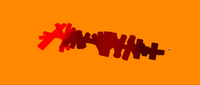

# Dag 3: Choose your own adventure!

I dag skal du velge selv hva du skal gjøre! Det er flere oppgaver, og det er meningen at du er litt kreativ og finner på din egen stil. Det er ingen anbefalt rekkefølge, og gjør gjerne flere eller alle oppgavene.

I hver oppgave går vi gjennom steg for steg i starten, men etter hvert blir det mer open ended og du får noen utfordringer du kan løse på din måte.

## [Orthographic car](./orthographic-car/README.md)

I denne oppgaven lager vi et lite bilspill i en orthografisk verden. Det er ingen shaderprogrammering i denne oppgaven! I stedet for å få forklart hver eneste kodelinje går vi gjennom hva som må gjøres, og hvilke komponenter og triks du må bruke for å få det til.

## [Flight simulator](./flightsimulator/README.md)

I denne lager du en flight simulator med teksturert terreng over vårt kjære Trondheim.

## [Perlin noise + Lighting](./perlin-noise/README.md)

I denne oppgaven skal vi bruke Perlin-støy til å lage en procedurally generated verden som vi lyser opp med vår egen lys-kilde.

## [Play With Sound](./play-with-sound/README.md)

I denne oppgaven skal vi leke videre med lydoppgaven fra dag 1

