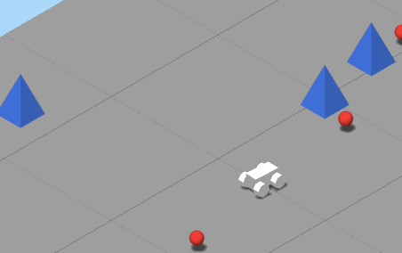

# Orthographic car

I denne oppgaven lager vi et lite bilspill i en orthografisk verden. Det er ingen shaderprogrammering i denne oppgaven! I stedet for å få forklart hver eneste kodelinje går vi gjennom hva som må gjøres, og hvilke komponenter og triks du må bruke for å få det til.



## Utdelt oppsett

Du får den vanlige skjelettkoden utdelt, og det er lagt til noen tomme funksjoner for å oppmuntre deg til å strukturere koden din litt.

Du kjører koden med følgende kommando: 

(Kjøres fra mappen over, der hvor package.json er)

```sh
npm run orthographic-car
```

og fasiten kan kjøres med:

```sh
npm run fasit-orthographic-car
```

## What to do

Den utdelte koden setter opp et `OrthographicCamera` som ser på en bilformet boks. Et orthografisk kamera har ikke perspektiv på samme måte som vanlige kameraer (og som vårt eget øye). I stedet for at alle linjer samles mot horisonten (tenk perspektiv-tegningene fra ungdomsskolens kunst og håndverk) er alle linjer parallelle (tenk gamle rollespill på Nintendo). I denne orthografiske verden skal vi lage et bilspill!

### 1. Lag en bakke ved hjelp av 5x5 `BoxGeometry` og et fint materiale 

Tips: For å oppnå god ytelse er det lurt å gjenbruke en geometry-instans og en material-instans om de skal være like.

Tips: For din egen del bør du strukturere koden litt. Lag f.eks. en ny funksjon `makeGround()`

### 2. Legg til fire hjul på bilen.

I den utdelte koden er det en enkel boks som representerer bilen. Men den er rimelig døll.

Tips: `THREE.CylinderGeometry` blir et fint hjul

Tips: Samle objekter i `new THREE.Group()` for å kunne flytte de sammen.

### 3. Beveg bilen med piltastene.

Tips: I den utdelte `util.js` er det en funksjon `addKeyListeners` som tar et objekt som parameter og legger til lyttere for tastetrykk. Objektet får verdien 0 eller 1 for hver av piltastene: `{left: 0, right: 0, up: 0, down: 0}`.

Tips: For å få en vektor som peker i bilens retning kan man bruke `car.getWorldDirection(direction)`. Send inn en `Vector3` som parameter, og den vil populeres med retningen. (Å sende inn en vektor i stedet for å returnere en ny vektor er en vanlig praksis i 3D-bibliotek for å unngå å måtte opprette for mange nye objekter.)

Tips: Endre på `.position` og `.rotation.y` for å henholdsvis forflytte og rotere rundt y-aksen.

### 4. Flytt kamera like mye som bilen har flyttet seg

Nå risikerer vi å kjøre bilen utenfor kameraet. Det er jo ikke slik bilspill funker, er det vel? Nei, vi må flytte kamera slik at det følger etter bilen.

Tips: I den utdelte koden er det en funksjon `moveCamera()` som er tenkt for dette.

### 5. Roter hjulene på bilen når den kjører

Bilen ser jo ikke helt realistisk ut, og det er viktig å gi spilleren følelsen av fart og mekanikk.

Tips: Det kan være ganske vanskelig å se at en perfekt sylinder roterer. Men i dokumentasjonen til CylinderGeometry ser vi at vi kan sette `radialSegments` ganske lav for å kunne se fasettene: https://threejs.org/docs/#api/en/geometries/CylinderGeometry

### 6. Fall ned når bilen er utenfor brettet

Hvis du har prøvd å kjøre utenfor brettet har du sett at immersion brytes ganske hardt når du når kanten. Og immersion er viktig i spill.

Tips: Kollisjonshåndtering er et eget fagfelt i 3D. Men en simpel måte er å bruke `THREE.js` sin innebygde `Box3`. Det er en axis-aligned boks i rommet med størrelse og plassering.

Tips: Om man har et objekt i scenen kan man lage en "bounding box" rundt dette med `new THREE.Box3().setFromObject(mittObjekt)`. En bounding box er en boks som er akkurat så stor som den trenger å være for å dekke hele objektet.

Tips: Et objekt MÅ være lagt til scenen før man kan beregne en bounding box. Ellers vet man jo ikke plasseringen og størrelsen i scenen.

Tips: Har man en `Box3` ved navn `boks1` kan man lett sjekke om den overlapper (kolliderer) med en annen boks: `boks1.intersectsBox(boks2)`.

### 7. Lag poeng-kuler på tilfeldige plasseringer

Et godt spill har et mål, og i dette spillet blir målet å samle inn alle poeng-kulene. (Eller poeng-tetrahedronene? Du bestemmer.)

Tips: Sjekk om bilen kolliderer med et poeng ved hjelp av `Box3.instersectsBox()`

Tips: Når man har tatt et poeng kan det skjules ved å endre feltet `.visible` til `false`. (Alle `Object3D` har dette feltet.)

### 8. Lag hindre som man kolliderer med

Et spennende spill har også utfordringer.

Tips: Vil du f.eks. ha små pyramider som hindre kan man bruke `ConeGeometry`

Tips: Når man kolliderer med et hinder kan bilen simpelthen sprette tilbake i den retningen den kom fra. Flytt bilen et lite stykke i retningen mellom hinderets og bilens posisjoner.

### 9. Pimp that shit

Spillet vårt er ikke helt på Unity-nivå når det gjelder grafikk og gameplay. Men noen enkle triks kan gjøres. For eksempel:

- Få poengene til å eksplodere når de tas

- Lag en mer detaljert bil med vinduer, hjulrom og terrengdekk

- Animer bilene videre slik at den steiler når man akselererer og lener seg ut i svingene

- Legg til `dat.gui` og lag kontrollere for fart, kollisjonskraft, brettstørrelse, og så videre

- Legg på skygge på bakken med `DirectionalLightShadow`: https://threejs.org/docs/#api/en/lights/shadows/DirectionalLightShadow

- Lag et hopp hvor bilen løftes opp lineært på vei opp rampen