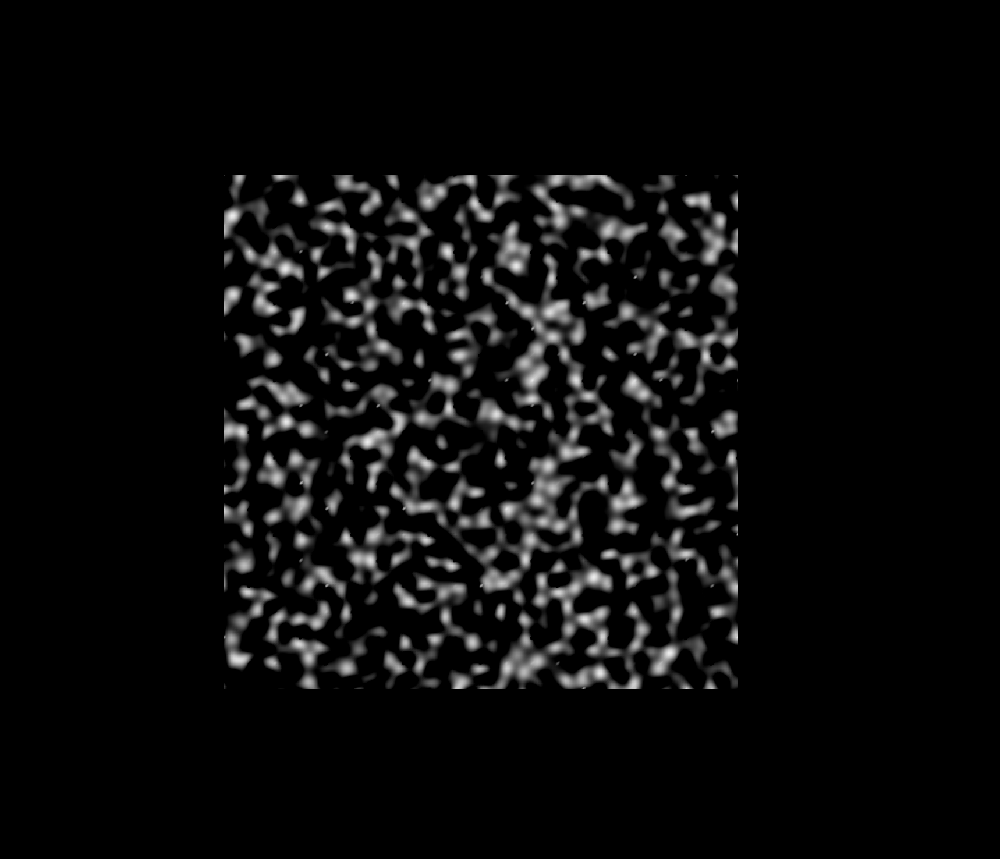
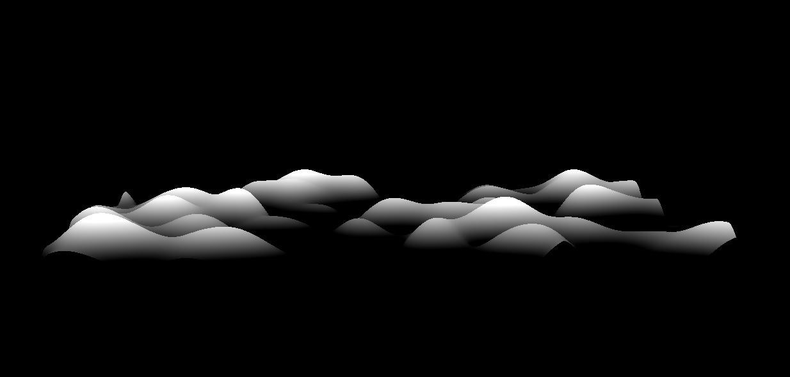

# Perlin noise + Lighting


I denne oppgaven skal vi bruke Perlin støy til å lage en procedurally generated verden som vi lyser opp med vår egen lys-kilde.

## Utdelt oppsett

Den utdelte koden er kjent fra tidligere oppgaver. Du får et ferdig oppset for three.js med camera, scene og renderer.

I tillegg får du en funksjon som lager et XY-plan vi skal bruke til å visualisere ting på. Planet har et ShaderMaterial med en vertex og en fragment shader. I tillegg er det laget en uniform for tid i sekunder, som vi skal bruke til animasjoner etterhvert.

Du kjører koden med følgende kommando

```sh
npm install
npm run perlin-noise
```

Når du kjører koden vil du se en hvit firkant midt på skjermen, da vet du at alt er OK og du kan starte med oppgaven.

Skulle du bli sittende fast kan du alltids ta en titt på fasiten med:

```sh
npm run fasit-perlin-noise
```

## Del 1: Perlin noise og glslify

Vi har eksperimentert med random-verdier tidligere i kurset, og da har du kanskje lagt merke til at det er vanskelig å få randomness til å se bra ut (utover komplett kaos). En av måtene vi kan beholde både random verdier og få ting som ser mer sammenhengende ut er Perlin Noise.

Perlin noise er en spesiell type funksjon som genererer pseudo random verdier som henger sammen. Den finnes i både 2D, 3D og 4D (egentlig nD). Måten Perlin noise fungerer på er at du gir funksjonen en vektor i `n` dimensjoner, og du vil få tilbake en float verdi som representerer det punktet i det `n`-dimensjonale rommet. Det som er kult med Perlin noise er at tallene du får til bake for punkter som er nærme hverandre også vil være nære hverandre.

Perlin, og arvtageren Simplex, er veldig mye brukt. Noe som er en fordel for oss, siden noen da har implementert algoritmene for `glsl` så vi kan bruke dem til å lage gøyale ting.

For å benytte oss av en ferdiglaga perlin-funksjon trenger vi å bruke et verktøy som heter `glslify`. `glslify` prosesserer glsl-filer for oss og syr sammen kode på samme måte som vi gjør i andre språk.

For å ta i bruk `glslify` på shaderne våre trenger vi å fortelle `glslify` hvilke filer som skal prosesseres. Det gjør vi ved å pakke inn shaderne våre i et kall til `glsl`-funksjonen fra `glslify`-pakka:

`index.js`:
```diff
+const glsl = require("glslify");

-const vertexShaderCode = fs.readFileSync(
+const vertexShaderCode = glsl(fs.readFileSync(
  `${__dirname}/vertexshader.glsl`,
  "utf8"
-);
+));
-const fragmentShaderCode = fs.readFileSync(
+const fragmentShaderCode = glsl(fs.readFileSync(
  `${__dirname}/fragmentshader.glsl`,
  "utf8"
-);
+));
```

Da får vi muligheten til å gjøre dette i shaderkoden vår:

`vertexshader.glsl`:
```diff
+#pragma glslify: snoise3 = require(glsl-noise/simplex/3d);
```

Da henter vi inn `snoise3`-funksjonen fra `glsl-noise`-pakka. `snoise3` er 3D-versjonen av Simplex Noise. Nå kan vi bruke noise til å fargelegge pixlene våre:

`vertexshader.glsl`:
```diff
#pragma glslify: snoise3 = require(glsl-noise/simplex/3d);

uniform float time;

+varying float noise;

void main() {
  vec4 modelSpaceCoordinates = vec4(position, 1.0);
  vec4 worldSpaceCoordinates = modelViewMatrix * modelSpaceCoordinates;
  vec4 screenSpaceCoordinate = projectionMatrix * worldSpaceCoordinates;

+  noise = snoise3(position);

  gl_Position = screenSpaceCoordinate;
}
```

Her lagrer vi noise-verdien som hentes ut fra posisjonen til vertexen og sender den videre til fragmentshaderen som en varying. Sa kan vi hente ut den varying-verdien i fragmentshaderen:

`fragmentshader.glsl`:
```diff
uniform float time;

+varying float noise;

void main() {
-    vec3 color = vec3(1.0, 1.0, 1.0);
+    vec3 color = vec3(noise, noise, noise);
    float alpha = 1.0;

    gl_FragColor = vec4(color, alpha);
}
```

Dette vil gi oss en ganske fin svart-hvit og noisy firkant.



## Del2: Bevegelig og interssant noise

Det som er gøy med Perlin og Simplex noise er at verdiene er stabile. Du vil alltid få samme verdi når du kaller funksjonen med samme verdi. Dette kan vi utnytte til å få det til å se ut som ting beveger seg. Ved å benytte `time`-verdien vår sammen med noise-funksjonen kan vi lage noe kult:

`vertexshader.glsl`:
```diff
-  noise = snoise3(position);
+  noise = snoise3(vec3(position.x, position.y + time, position.z));
```

>💡 Prøv å legge til eller trekke fra time på en av de andre dimensjonene for å få feltet til å bevege seg i ulike retninger. Hvis du legger det til z-komponenten skjer det noe annerledes, hva tror du er årsaken til det?

For å gjøre noisen litt mer interessant går det an å endre litt på hvordan vi generer det. Feks ved å sample noise i et mindre areal og legge det til et større areal. Hvis vi skalerer ned posisjons-vektoren vi sender til noise-funksjonen reduserer vi oppløseligheten til støyen:

`vertexshader.glsl`:
```diff
-  noise = snoise3(vec3(position.x, position.y + time, position.z));
+  noise = snoise3(0.25 * vec3(position.x, position.y + time, position.z));
```

Et anna triks som lager gøyale resultater er å legge sammen to ulike noise-verdier:

`vertexshader.glsl`:
```diff
-  noise = snoise3(0.25 * vec3(position.x, position.y + time, position.z));
+  float n1 = snoise3(0.25 * vec3(position.x, position.y + time, position.z));
+  float n2 = snoise3(0.1 * vec3(position.x, position.y + time, position.z));
+  noise = n1 + n2;
```

Da får du noe som begynner å minne om et veldig blurry satelittbilde av terreng. Da er vi på spor av noe kult.

>💡 Prøv å justere verdiene som du ganger med posisjonsvektoren, endre regnestykket til å trekke fra noise, eller legge til flere noises.

## Del 3: Generert terreng!

Før vi går i gang med å generere terreng bør vi rydde litt i shader-koden vår. Vi starter med å trekke ut noise-genereringen til en egen funksjon:

`vertexshader.glsl`:
```diff
+float noiseFunction(float t, vec3 position) {
+  vec3 offsetPosition = vec3(position.x, position.y + t, position.z);
+  float n1 = snoise3(0.25 * offsetPosition);
+  float n2 = snoise3(0.1 * offsetPosition);
+  float n = n1  + n2;
+
+  return n;
+}

void main() {
  vec4 modelSpaceCoordinates = vec4(position, 1.0);
  vec4 worldSpaceCoordinates = modelViewMatrix * modelSpaceCoordinates;
  vec4 screenSpaceCoordinate = projectionMatrix * worldSpaceCoordinates;

-  float n1 = snoise3(0.25 * vec3(position.x, position.y + time, position.z));
-  float n2 = snoise3(0.1 * vec3(position.x, position.y + time, position.z));
-  noise = n1 + n2;
+  noise = noiseFunction(time, position);

  gl_Position = screenSpaceCoordinate;
}
```

For å lage illusjonen om terreng kan vi bruke noise-verdien til å flytte vertexene til planet vi jobber med langs z-aksen (den aksen som peker ut fra skjermen):

`vertexshader.glsl`:
```diff
void main() {
+  float n = noiseFunction(time, position);
-  vec4 modelSpaceCoordinates = vec4(position, 1.0);
+  vec4 modelSpaceCoordinates = vec4(position.xy, position.z + n, 1.0);
  vec4 worldSpaceCoordinates = modelViewMatrix * modelSpaceCoordinates;
  vec4 screenSpaceCoordinate = projectionMatrix * worldSpaceCoordinates;

-  noise = noiseFunction(time, position);
+  noise = n;

  gl_Position = screenSpaceCoordinate;
}
```

Når du ha gjort dette vil du se at omtrent ingenting har forandra seg, men hvis du bruker musa til å tilte kameraet litt så vil du se at planet har begynt å ligne med på terreng!



Det som er greia her er at PlaneGeometry i three.js alltid er lagt til XY-planet, hvis vi ønsker oss et XZ-plan med Y-aksen oppover så må vi lage noe eget... eller bruke litt trigonometri til å fikse problemet.

`index.js`:
```diff
function init() {
  scene = new THREE.Scene();
+  scene.rotation.set(-Math.PI / 2, 0, 0);

  initCamera();
  initRenderer();
  initDatGui();
  initPlane();

  document.body.appendChild(renderer.domElement);
}
```

Ved å rotere hele scenen med -90 grader (90 grader === PI/2) langs X-aksen flytter vi om på ting slik at XY-planet er vannrett og Z-aksen peker oppover. Vi har nå et terreng!

For å se terrenget fra en litt mer interessant vinkel kan vi flytte litt på utgangsposisjonen til kameraet vårt:

`index.js`:
```diff
-  camera.position.set(0, 0, 50);
+  camera.position.set(0, 10, 15);
```

Nå ser det nesten ut som vi flyr over et slags spøkelseslandskap 👻

Hvis vi vil, så kan vi gjøre åsene i landskapet høyere ved å multiplisere noise-verdien med en eller annen faktor, feks `2.5`:

`vertexshader.glsl`:
```diff
float noiseFunction(float t, vec3 position) {
  vec3 offsetPosition = vec3(position.x, position.y + t, position.z);
  float n1 = snoise3(0.25 * offsetPosition);
  float n2 = snoise3(0.1 * offsetPosition);
  float n = n1  + n2;

-  return n;
+  return n * 2.5;
}
```

## Del 4: Litt farger

Det er kjedelig med ting som er svart-hvitt, la oss legge til litt farge på terrenget vårt. Vi kan benytte oss av noise-verdien til å fargelegge ting med en gradient, feks fra mørkegrønn til lysegrønn.

`fragmentshader.glsl`:
```diff
void main() {
-  vec3 color = vec3(noise);
+  vec3 color = mix(vec3(0.0, 0.25, 0.0), vec3(0.0, 1.0, 0.0), noise / 2.5);
  float alpha = 1.0;

  gl_FragColor = vec4(color, alpha);
}
```

For å gjøre dette bruker vi den innebygde `mix`-funksjonen. Den vil interpolere mellom to verdier gitt et tall mellom 0 og 1 (nære 0 betyr nære den frøste verdien, mens nære 1 betyr nære den andre verdien). Siden noise-verdien vi får ut er ganget med `2.5` kan vi dele på `2.5` her, for å få verdien innafor `[0, 1]` igjen. Nå får vi en deilig neon-grønn farge på ting.

I tillegg kan vi bruke et triks fra Three.js til å gi oss skikkelig matrix-følelse:

`index.js`:
```diff
let material = new THREE.ShaderMaterial({
  vertexShader: vertexShaderCode,
  fragmentShader: fragmentShaderCode,
+  wireframe: true,
  uniforms
});
```

Om du liker effekten kan du la den være på, det er opp til deg!

## Del 5: Let there be darkness! 🔦

Det er litt kjedelig at hele terrenget synes hele tiden, mye gøyere hvis du bare får se litt av det. For å gjøre det kan vi legge til litt kunstig belysning.

Vi starter med å definere hvor lyset vårt skal befinne seg

`index.js`:
```diff
let uniforms = {
-  time: { value: 0 }
+  time: { value: 0 },
+  light: { value: new THREE.Vector3(0, 0, 2) }
};
```

Vi setter lyset til å befinne seg i `[0,0,2]`, det vil si i sentrum av planet vårt og litt opp (langs Z-aksen). Vi setter lys-posisjonen som en uniform, siden den vil være lik for alle vertices i scena. Nå kan vi bruke lys-posisjonen til å belyse scena vår.

>❕Three.js har noen innebygde lys-greier, men de fungerer ikke når vi bruker våre egne shadere. Så vi må derfor implementere vår egen belynsing. Men det gjør ikke noe, siden det er ganske lærerikt.

Den lysmodellen vi skal implementere kalles diffuse lightning. Det er en veldig enkel lysmodell som belyser overflaten til objekter med flatt lys.


For å regne ut hvor belyst noe blir trenger vi 3 ting: normal-vektoren og posiosjonen til vertexen og posisjonen til lyset. Posisjonen til lyset har vi som en uniform, normal-vektoren og vertex-posisjonen kan vi sende med som varying.

`vertexshader.glsl`
```diff
+varying vec3 positionVec;
+varying vec3 normalVec;
varying float noise;

void main() {
  // ...

+  positionVec = position;
+  normalVec = normal;
  noise = n;

  // ...
}
```

`fragmentshader.glsl`
```diff
uniform float time;
+uniform vec3 light;

varying float noise;
+varying vec3 positionVec;
+varying vec3 normalVec;

void main() {
+  vec3 normal = normalize(normalVec);
+  vec3 lightDir = normalize(light - positionVec);
+  float diffuse = max(0.0, dot(lightDir, normal));

  vec3 color = mix(vec3(0.0, 0.25, 0.0), vec3(0.0, 1.0, 0.0), noise);
+  vec3 finalColor = diffuse * color;

-  gl_FragColor = vec4(color, 1.0);
+  gl_FragColor = vec4(finalColor, 1.0);
}
```

Det er ikke så lett å se, men du skal nå ha en sterkere grønnfarge i midten av terrenget ditt. Vi kan forsterke effekten ved å si at alt som ikke får minst `0.5` av lyset skal være helt mørkt:

`fragmentshader.glsl`:
```diff
void main() {
  vec3 normal = normalize(normalVec);
  vec3 lightDir = normalize(light - positionVec);
  float diffuse = max(0.0, dot(lightDir, normal));

  vec3 color = mix(vec3(0.0, 0.25, 0.0), vec3(0.0, 1.0, 0.0), noise);
-  vec3 finalColor = diffuse * color;
+  vec3 finalColor = (max(0.5, diffuse) - 0.5) * color;

  gl_FragColor = vec4(finalColor, 1.0);
}
```

Vi kan også si at lyset der det treffer skal være litt sterkere:

```diff
-  vec3 finalColor = (max(0.5, diffuse) - 0.5) * color;
+  vec3 finalColor = (max(0.5, diffuse) - 0.5) * 2.0 * color;
```

Nå har vi en ganske kul lommelykt effekt, men den er litt kjedelig å se på. Vi kan lage oss en liten kule som fungerer som lyskilde!

`index.js`
```diff
+const orbVertexShaderCode = glsl(
+  fs.readFileSync(`${__dirname}/orb-vertexshader.glsl`, "utf8")
+);
+const orbFragmentShaderCode = glsl(
+  fs.readFileSync(`${__dirname}/orb-fragmentshader.glsl`, "utf8")
+);

// ...

- let plane;
+let plane, orb;

// ...

initCamera();
initRenderer();
initDatGui();
initPlane();
+initOrb();

// ...

+function initOrb() {
+  let geometry = new THREE.SphereBufferGeometry(0.1, 8, 8);
+  let material = new THREE.ShaderMaterial({
+    vertexShader: orbVertexShaderCode,
+    fragmentShader: orbFragmentShaderCode,
+    uniforms
+  });
+
+  orb = new THREE.Mesh(geometry, material);
+  orb.position.set(0, 0, 2);
+  scene.add(orb);
+}
```

(Disse to shaderne er identiske med de standardshaderne dere fikk utdelt)

`orb-fragmentshader.glsl`:
```c
void main() {
  vec3 color = vec3(1.0, 1.0, 1.0);
  float alpha = 1.0;
  gl_FragColor = vec4(color, alpha);
}
```

`orb-vertexshader.glsl`:
```c
void main() {
  vec4 modelSpaceCoordinates = vec4(position, 1.0);
  vec4 worldSpaceCoordinates = modelViewMatrix * modelSpaceCoordinates;
  vec4 screenSpaceCoordinate = projectionMatrix * worldSpaceCoordinates;

  gl_Position = screenSpaceCoordinate;
}
```

Det vi har laga nå er en liten kule, bare `0.1` i diameter (vi trenger ikke mer, siden scena vår er ganske liten) med sine egne shadere (som vi kommer til å bruke senere) som har samme posisjon som lyskilden vår.

Det du kanskje vil se etterhvert er at lyskilden vår kolliderer med noen av åsene vi har laga (spesielt hvis du har multiplisert noise-verdien og fått høyere åser). For å unngå dette, og lage en ganske kul effekt, kan vi flytte både lyset og kula vår opp like mye som vi flytter terrenget. Med andre ord, vi bruker noise-verdien til å flytte på lyset.

## Del 6: Moving lights.

Det første vi trenger nå er å vite hvor mye lyset skal flytte seg, for å gjøre det bruker vi noise-funksjonen vår. Så sender vi den verdien videre til fragment shaderen gjennom en varying.

`vertexshader.glsl`:
```diff
uniform float time;
+uniform vec3 light;

varying vec3 positionVec;
varying vec3 normalVec;
varying float noise;
+varying float lightNoise;

void main() {
  // ...

  positionVec = position;
  normalVec = normal;
  noise = n;
+  lightNoise = max(0.0, noiseFunction(time, vec3(light.xy, 0)));

  // ...
}
```

En ting det er verdt å merke seg her er at vi ikke bruker hele posisjonen til lyset når vi henter ut noise-verdien. Dette er for at vi skal bruke samme Z-komponent som terrenget (0) og ikke den verdien vi har på lyset (2).

`fragmentshader.glsl`:
```diff
varying float noise;
varying vec3 positionVec;
varying vec3 normalVec;
+varying float lightNoise;

void main() {
  vec3 normal = normalize(normalVec);
+  vec3 lightPos = vec3(light.xy, light.z + lightNoise);
-  vec3 lightDir = normalize(light - positionVec);
+  vec3 lightDir = normalize(lightPos - positionVec);
  float diffuse = max(0.0, dot(lightDir, normal));
  // ...
}
```

Legg merke til at vi flytter lyset langs Z-aksen, akkurat som vi gjør med vertex posisjonen i vertex-shaderen.

Så må vi gjøre noe tilsvarende med lys-kula vår. Da trenger vi å gjenbruke noise funksjonen vi har i `vertexshader.glsl`. For å gjøre det kan vi lage vår egen `glslify`-modul. Det gjør vi enkelt ved å putte funksjonen i en egen fil og legge på en export-pragma:

`noise.glsl`:
```c
#pragma glslify: snoise3 = require(glsl-noise/simplex/3d);

float noiseFunction(float t, vec3 position) {
  vec3 offsetPosition = vec3(position.x, position.y + t, position.z);
  float n1 = snoise3(0.25 * offsetPosition);
  float n2 = snoise3(0.1 * offsetPosition);
  float n = n1 + n2;

  return n * 2.5;
}

#pragma glslify: export(noiseFunction)
```

Så kan vi erstatte noise-funksjonen i `vertexshader.glsl` med den nye modulen slik:

`vertexshader.glsl`:
```diff
+#pragma glslify: noiseFunction = require(./noise.glsl);

// ...

-float noiseFunction(float t, vec3 position) {
-  vec3 offsetPosition = vec3(position.x, position.y + t, position.z);
-  float n1 = snoise3(0.25 * offsetPosition);
-  float n2 = snoise3(0.1 * offsetPosition);
-  float n = n1  + n2;
-
-  return n * 2.5;
-}
```

Da kan vi også bruke noise-funksjonen i `orb-vertexshader.glsl`:

`orb-vertexshader.glsl`
```diff
+#pragma glslify: noiseFunction = require(./noise.glsl);

+uniform float time;
+uniform vec3 light;

void main() {
+  float n = max(0.0, noiseFunction(time, vec3(light.xy, 0)));

-  vec4 modelSpaceCoordinates = vec4(position, 1.0);
+  vec4 modelSpaceCoordinates = vec4(position.xy, position.z + n, 1.0);
  vec4 worldSpaceCoordinates = modelViewMatrix * modelSpaceCoordinates;
  vec4 screenSpaceCoordinate = projectionMatrix * worldSpaceCoordinates;

  gl_Position = screenSpaceCoordinate;
}
```

Nå har vi et lys som flytter seg i takt med terrenget!

>💡 Du kan fikle med parameterne til lyset og kula, sånn som feks hvor høyt over bakken utgangsposisjonen skal være eller hvor langt lyset lyser eller hvor sterkt lyset lyser.

Vi kan også flytte lyset litt fra side til side, for å få en litt mer interessant effekt. Det kan vi gjøre ved å endre utgangsposisjonen til både lyset og kula i render-funksjonen vår. Vi bruker sinus av tiden til å få en fin oscillering på banen:

`index.js`
```diff
function render() {
  requestAnimationFrame(render);
  // time in s
  let time = (Date.now() - t0) * 0.001;
  uniforms.time.value = time;

+  let displacement = 2.5 * Math.sin(0.5 * time);
+  uniforms.light.value = new THREE.Vector3(displacement, 0, 2);
+  orb.position.set(displacement, 0, 2);

  renderer.render(scene, camera);
}
```

Gratulerer, du har nå laga et procedurally generated terreng med en liten lysende kule som er på en evig reise i mørket! Passer bra til årstida.

Det er mange gøyale parametre å skru på i denne visualiseringen, så her er det bare å være kreativ.
